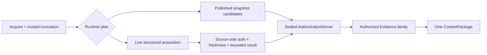

# QM 综合评估与 ContextEngine 场景适配蓝图

> **Room-A 维护者本地研究 — 非公开 provenance / authority。** 本文可以影响维护者的独立推理、内部规格与测试 oracle，但不会自动把 QM 加入
> [`2026-07-19 四仓公开证据基线`](./2026-07-19-four-public-repositories-evidence.md)，也不能作为公开产品声明的来源。若未来需要公开引用 QM，必须先由维护者明确准入、逐项复核 permalink 与许可证边界，并版本化更新公开证据基线。
>
> 研究日期：2026-08-02
> 上游仓库：[`yc-software/qm@7f2c916`](https://github.com/yc-software/qm/tree/7f2c916360f1797a8ff2a77ce2ce40c5fabab087)
> 固定 commit：[`7f2c916360f1797a8ff2a77ce2ce40c5fabab087`](https://github.com/yc-software/qm/commit/7f2c916360f1797a8ff2a77ce2ce40c5fabab087)
> 对应 release：`v0.1.4`
> 许可证事实：根仓 MIT；仍须按路径核验任何未来复制候选
> 本次 copy+patch：**none**

## 1. 执行结论

QM 值得研究，但不应该成为 ContextEngine 的实现基座。

它是一个面向单组织内部成员的多人 agent harness：把身份、DM/群聊/频道 scope、session、工具、持久 sandbox、模型 harness、Slack/Web surface 和外部效果组织成一条完整 agent turn。它不是文档 ingestion、embedding、向量检索或安全 context delivery engine。上游也明确声明它是 early experimental software，且不是 hardened public or multi-tenant boundary（[`SECURITY.md#L1-L5`](https://github.com/yc-software/qm/blob/7f2c916360f1797a8ff2a77ce2ce40c5fabab087/SECURITY.md#L1-L5)、[`SECURITY.md#L24-L33`](https://github.com/yc-software/qm/blob/7f2c916360f1797a8ff2a77ce2ce40c5fabab087/SECURITY.md#L24-L33)）。

QM 对 ContextEngine 的新增价值集中在**消费与交付边界**，而不是 Supply 或检索算法：

1. **Scope layering 是好的 caller experience。** `org` 只读、当前 personal/room scope 可写、DM 可附 team 只读层，清楚表达“组织默认 + 当前工作上下文 + caller 收窄”。ContextEngine 可吸收这种输入和 UX 形状，但授权真相仍只能来自当前 Principal、Membership、source ACL 与 sealed `AuthorizationKernel`。
2. **多人 audience 是必须支持的真实 workload。** QM 对 allow 做 audience intersection、对 deny 做 union、空 audience 返回空。这与 [ADR-0003](../decisions/0003-group-chat-intersection-authorization.md) 一致，可作为行为 oracle；但 QM 自己承认 origin labels 与 ambient Slack path 仍有缺口，因此不能成为我们的授权实现。
3. **Capability self-API 很适合 agent consumer。** 每回合 token 只暴露“此刻可调用”的接口目录，是比向 agent 塞入全部 API 更好的 discoverability 形状。ContextEngine 应用 generated SDK 的窄 facade 表达同一思想，不为 QM 初版增加 MCP。
4. **Surface context pull 是结构化 acquisition 的第一个可信触发器。** QM 的 `request → surface fulfillment → bounded result` 证明 agent 会在 request time 向 Slack/API 拉 live context。它应触发 [ADR-0061](../decisions/0061-commit-to-the-complete-context-layer-thesis.md) 中延期的 structured acquisition family，而不是伪造 `ContextRevision`、绕开 Kernel 或把 live result 直接交给模型。
5. **Durable session tape 与 memory strategy 是 Learning/eval 输入形状。** speaker provenance、autonomous-turn exclusion、secret exclusion、burst buffering 与 consolidation 可成为候选生成测试 oracle；原始 transcript 和 mutable notebook 不能直接进入 active corpus，模型也不能拥有发布权。

因此推荐关系是：**QM 作为 ContextEngine 的外部 trusted consumer / BotDelivery workload，以及未来 structured acquisition 的 surface provider；ContextEngine 继续独立拥有多租户授权、ContextPackage、RLS、release 与 Learning authority。**

## 2. 证据边界与验证结果

### 2.1 证据等级

- **[一手静态]**：固定 SHA 的上游源码、测试、CI、README、SECURITY 或 LICENSE；只证明该 checkout 存在对应结构。
- **[本地动态]**：在固定 checkout 上实际运行的命令；只证明本地 Node 环境下覆盖到的路径，不升级为生产安全或可扩展性证明。
- **[本仓综合]**：依据 ContextEngine 已接受 ADR、实现 seam 和上游一手材料形成的独立设计结论。
- **[未取证]**：未启动真实完整部署、真实 Slack、外部模型、浏览器、AWS/Fly、攻击测试或统一 benchmark 的事实。

仓库外研究不属于 ContextEngine 的公开 provenance。本文中的所有上游源码引用固定到完整 SHA；未来上游 `main` 的变化不会自动继承本结论。

### 2.2 上游身份、许可证与成熟度

| 项目 | 核验结果 | 影响 |
|---|---|---|
| 固定版本 | commit `7f2c916360f1797a8ff2a77ce2ce40c5fabab087`；release `v0.1.4` | 所有结论只覆盖该版本 |
| 许可证 | 根 [`LICENSE`](https://github.com/yc-software/qm/blob/7f2c916360f1797a8ff2a77ce2ce40c5fabab087/LICENSE#L1-L21) 为 MIT；README 表述为 “except where otherwise noted” | 允许评估复制候选，不等于无需逐路径 legal/SBOM/attribution |
| 产品定位 | 官方定义为 multiplayer agent harness（[`README.md#L1-L19`](https://github.com/yc-software/qm/blob/7f2c916360f1797a8ff2a77ce2ce40c5fabab087/README.md#L1-L19)） | 应按 consumer/harness 评估，不与 RAG engine 直接打分 |
| 安全成熟度 | early experimental；单组织内部用户；非 hardened multi-tenant boundary | 不可承担 ContextEngine Security Veto |
| 历史解释 | 公开仓 history 很短，SECURITY 说明公开版本来自 fresh export（[`SECURITY.md#L155-L161`](https://github.com/yc-software/qm/blob/7f2c916360f1797a8ff2a77ce2ce40c5fabab087/SECURITY.md#L155-L161)） | commit 数、star 数都不能独立证明成熟度 |
| CI 形状 | core shards、typecheck/lint/plugins/CLI/PostgreSQL jobs；数据库 CI 用 PG16（[`.github/workflows/cicd.yml#L14-L90`](https://github.com/yc-software/qm/blob/7f2c916360f1797a8ff2a77ce2ce40c5fabab087/.github/workflows/cicd.yml#L14-L90)、[`cicd.yml#L150-L178`](https://github.com/yc-software/qm/blob/7f2c916360f1797a8ff2a77ce2ce40c5fabab087/.github/workflows/cicd.yml#L150-L178)） | 测试工程值得肯定；不覆盖 ContextEngine 的 PG17 + non-owner + FORCE RLS contract |

### 2.3 本地动态验证

固定 checkout 上已经实际运行：

| 命令/范围 | 结果 | 边界 |
|---|---|---|
| `npm ci` | 成功；上游 root 声明 Node `>=24.15.0`，但依赖 `ini@7.0.0` 只接受 `^22.22.2 \|\| ^24.15.0 \|\| >=26.0.0`，当前 Node `25.8.0` 因此出现 `EBADENGINE` warning | 依赖可安装；验证环境落在该依赖未声明支持的 Node 版本带 |
| `npm run typecheck` | 通过 | 静态类型门通过 |
| `npm run lint` | 通过 | ESLint 门通过 |
| `npm run format:check` | 通过 | 格式门通过 |
| 精选 scope/audience/memory/context 测试 | 42 pass，0 fail | 只覆盖本报告关注的局部行为 |
| `npm test` | 3,712 tests；3,580 pass；0 fail；132 skip；约 95 秒 | skip 包含未配置的真实 PostgreSQL/外部环境路径；不能声称完整 production topology 已验证 |

未运行 live Slack、真实外部模型/浏览器、AWS/Fly 部署、渗透、故障注入、load test 或与 ContextEngine corpus 的统一 retrieval benchmark。QM 的测试绿灯证明其固定 checkout 具有扎实的回归基础，不证明其授权模型可移植，也不证明本仓适配已经实现。

## 3. Repository 综合评估

### 3.1 它真正是什么

QM 的官方拓扑由 headless core、agent loop、PostgreSQL 和 per-scope sandbox 构成。core 处理 API、identity、policy 与 scheduler；agent loop 可切换 Pi、OpenCode、Codex 和 Claude Code；Slack 是 in-process plugin，Web/Admin/Portal 是 HTTP API plugin（[`README.md#L44-L78`](https://github.com/yc-software/qm/blob/7f2c916360f1797a8ff2a77ce2ce40c5fabab087/README.md#L44-L78)）。

它的核心领域链是：

```text
Principal → Conversation → Scope → Session / SessionEntry
          → WorkspaceLayer / Grant → Agent turn → model/tools/effects
```

`SessionEntry` 可以记录 user、assistant、thinking、tool call/result、delivery 和 approval；`WorkspaceLayer` 明确 `ro|rw`；grant 把 owner scope/resource 映射到 grantee scope（[`src/types.ts#L50-L140`](https://github.com/yc-software/qm/blob/7f2c916360f1797a8ff2a77ce2ce40c5fabab087/src/types.ts#L50-L140)）。这是一个完整 agent operating environment 的模型，不是 ContextEngine 的 `ContextSource → ContextResource → ContextRevision → ContextFragment → Evidence → ContextPackage` 模型。

### 3.2 强项

| 强项 | 一手事实 | 对 ContextEngine 的意义 |
|---|---|---|
| 多人 scope 产品模型 | 每人和每个 room 拥有独立 memory/files/permissions/sandbox（[`README.md#L7-L31`](https://github.com/yc-software/qm/blob/7f2c916360f1797a8ff2a77ce2ce40c5fabab087/README.md#L7-L31)） | 给出真实 consumer 如何表达 personal/shared context 的 workload |
| 清楚的 scope layering | DM→personal；group/channel→room；org RO、current RW、DM team RO（[`resolution-service.ts#L15-L45`](https://github.com/yc-software/qm/blob/7f2c916360f1797a8ff2a77ce2ce40c5fabab087/src/resolution/resolution-service.ts#L15-L45)） | 可借鉴为 AgentVersion ceiling + request narrowing UX |
| Audience floor | history 对所有 audience principal 取 entitlement 交集；allow hosts 交集、deny hosts 并集（[`context-filter.ts#L4-L27`](https://github.com/yc-software/qm/blob/7f2c916360f1797a8ff2a77ce2ce40c5fabab087/src/resolution/context-filter.ts#L4-L27)、[`audience-floor.ts#L39-L59`](https://github.com/yc-software/qm/blob/7f2c916360f1797a8ff2a77ce2ce40c5fabab087/src/resolution/audience-floor.ts#L39-L59)） | 强化 ADR-0003 的群聊交集 oracle |
| Agent self-API | token-bound `/v1/apis` 动态列出当前可用 endpoint（[`agent-api-catalog.ts#L23-L52`](https://github.com/yc-software/qm/blob/7f2c916360f1797a8ff2a77ce2ce40c5fabab087/src/api/agent-api-catalog.ts#L23-L52)） | generated SDK 上可做 capability-aware closed facade |
| Request-time surface pull | bounded count/match/before，异步 request/fulfill/timeout，viewer-bound target resolution（[`routes/context.ts#L10-L91`](https://github.com/yc-software/qm/blob/7f2c916360f1797a8ff2a77ce2ce40c5fabab087/src/api/routes/context.ts#L10-L91)） | 给 structured acquisition family 一个具体、可验 workload |
| Session/memory 实验面 | transcript fact extraction 区分用户陈述、autonomous turn、secret/system mechanics（[`per-turn.ts#L7-L58`](https://github.com/yc-software/qm/blob/7f2c916360f1797a8ff2a77ce2ce40c5fabab087/src/memory/strategies/per-turn.ts#L7-L58)） | 可转成 Learning candidate 的 provenance/quality oracle |
| 可替换 harness | 同一 core 支持多种 coding-agent/model harness（[`harness.ts#L43-L89`](https://github.com/yc-software/qm/blob/7f2c916360f1797a8ff2a77ce2ce40c5fabab087/src/harness/harness.ts#L43-L89)） | 验证 ContextPackage consumer contract 不应绑定单一模型供应商 |
| 诚实的 threat model | 主动列出 command、browser、credential、audience、egress、retention 与 gateway 缺口 | 这些负面事实可直接成为适配拒绝条件和 adversarial oracle |

### 3.3 局限与风险

1. **不是通用 RAG/Context pipeline。** Slack mirror 主要是消息 cache + PostgreSQL FTS；memory 是每 scope 的 Markdown notebook 与 lexical substring recall，不存在可核验的 embedding/pgvector pipeline。README 中“search internal notes/email/documents/databases”是产品用例，不能升级成已实现的通用 ingestion/retrieval 证据。
2. **不是 ContextEngine 所需的多租户安全边界。** QM 的官方边界是一部署一组织；数据库没有本仓要求的 Organization-bound non-owner transaction 与 FORCE RLS 证明。`scopeId` 是 QM 内部产品对象，不是可导入的 authorization grant。
3. **Audience 实现有自承缺口。** 上游指出部分 model-context entry 缺完整 origin label，ambient Slack judge 也未重复全部 internal-only check（[`SECURITY.md#L113-L116`](https://github.com/yc-software/qm/blob/7f2c916360f1797a8ff2a77ce2ce40c5fabab087/SECURITY.md#L113-L116)）。因此其 intersection 只能是行为方向，不是安全证明。
4. **Classifier 和 command policy 都不是 authorization。** Auto screening 是 heuristic 且覆盖不完整；command policy 可被 obfuscation/script 绕过（[`SECURITY.md#L86-L112`](https://github.com/yc-software/qm/blob/7f2c916360f1797a8ff2a77ce2ce40c5fabab087/SECURITY.md#L86-L112)）。ContextEngine 不能把 screening success 当 Evidence admission。
5. **Egress 与 model gateway 没有形成统一不可旁路边界。** 上游承认 egress enforcement 取决于 backend，且部分 model path 绕过 intended gateway（[`SECURITY.md#L117-L119`](https://github.com/yc-software/qm/blob/7f2c916360f1797a8ff2a77ce2ce40c5fabab087/SECURITY.md#L117-L119)、[`SECURITY.md#L137-L139`](https://github.com/yc-software/qm/blob/7f2c916360f1797a8ff2a77ce2ce40c5fabab087/SECURITY.md#L137-L139)）。这与 ContextEngine 的 per-hop `EgressGrant`、wrong-hop zero bytes 约束不同。
6. **Durable transcript/memory 的隐私生命周期不完整。** request capture 默认开启，session、memory、model request 与 file artifact 可能长期保留；artifact retirement/byte reclamation 未实现（[`SECURITY.md#L120-L128`](https://github.com/yc-software/qm/blob/7f2c916360f1797a8ff2a77ce2ce40c5fabab087/SECURITY.md#L120-L128)）。因此不能把 QM tape 自动接入 Learning。
7. **Prompt assembler 不是 ContextPackage。** 它把 instructions、surface、files、skills、credentials、roster、memory 等直接组合为模型上下文；没有 ContextPackage 的 exact Block/Evidence closure、policy epoch、audience digest、TTL、budget、release lineage 与 final veto。

## 4. 能力映射与采纳矩阵

| QM 能力/形状 | ContextEngine seam | 分类 | 采纳规则 | 必须拒绝的隐含前提 |
|---|---|---|---|---|
| `org RO + current RW + DM team RO` layer | `AgentVersion` ceiling、server-derived capabilities、`RequestNarrowing` | **adapt** | 保留层级化 consumer UX；server 把选择收窄为已授权 exact targets | layer/scope ID 自身授予访问权 |
| personal/channel/group/team/org scope vocabulary | Organization、Principal、Membership、Source/Article grants、audience | **strategic reference** | 只做 adapter mapping；每项都重建为本仓 nominal type | QM scope 与 ContextEngine scope/grant 一一等价 |
| history/audience intersection | `AudienceSnapshot`、ADR-0003、Kernel | **behavior oracle** | public audience 取完整 current membership 交集；空/未知/stale fail closed | 上游 filter 或 caller member list 是 trusted fact |
| allow intersection + deny union | effective egress policy、per-hop `EgressGrant` | **adapt + strengthen** | 用作策略组合 oracle；最终 grant 仍绑定 Package/provider/audience/purpose/epoch/expiry | host list 足以证明网络和模型 egress |
| token-bound `/v1/apis` | OpenAPI generated TS SDK、consumer facade | **adopt shape** | 对当前 consumer/profile 只暴露 allowed operation 与 typed docs | 动态目录本身授予 capability；agent 可发现并调用内部 seam |
| `/v1/surface-context` request/fulfill | ADR-0061 structured acquisition family | **spike workload** | 保留 bounded request、timeout/failure、source-side auth/freshness；最后仍生成 ContextPackage | live API result 可以伪装成 Revision/Fragment 或直送模型 |
| per-turn session tape | ContextRun + future Learning intake | **adapt late** | 只在 consent/retention/encryption/delete-export 完整后产候选 | transcript 是默认可训练语料；assistant/tool text 等于用户事实 |
| fact extraction/consolidation | CurationCandidate、eval slices、promote | **behavior/eval oracle** | 测 speaker provenance、secret exclusion、autonomous exclusion、idempotency | 模型可直接追加、merge、replace active memory |
| mutable Markdown memory + substring recall | Supply/Runtime retrieval | **do-not-take** | 最多用作 benchmark baseline | mutable notebook 是 immutable provenance 或高质量 retrieval |
| prompt/context concatenation | ContextPackage、`AuthorizedModelInput` | **do-not-take** | QM 只能消费完整 current Package；模型输入必须由 Package + matching grant 构造 | string concat 保留授权、citation、TTL、budget 与 revocation |
| Slack cache/FTS | future surface Provider / structured acquisition carrier | **strategic reference** | 只把 surface 当 source；结果仍 exact-authorize | source visibility/filter 就是最终 content authorization |
| capability token / blob link | `DeliveryEvidenceRef`、`CitationOpenRef`、`EgressGrant`、`ActionTicket` | **shape only** | 保留短 TTL、audience/actor/binding/replay 的分离概念 | 一个通用 bearer 可跨 read/model/send/write hop 复用 |
| harness routing | external consumer/BotDelivery | **adopt compatibility goal** | ContextPackage contract 对 Pi/Codex/Claude/OpenCode 一致 | Engine 需要认识或嵌入每个 harness |
| per-scope sandbox | QM execution plane；ContextEngine 外部 | **out of scope** | 不进入 ContextEngine Runtime；效果仍经 ActionPlane | sandbox isolation 是内容授权或 effect authorization |
| in-process MCP bridge | optional future adapter | **do-not-take now** | 初版直接使用 HTTP/generated SDK；真实 consumer gap 出现后再议 MCP | 有 agent 就必须新增 MCP transport |
| deployment directory / one-org cloud | deployment integration | **strategic reference** | QM adapter 配置可位于 deployment layer；secret 只引用 live source | ContextEngine 应退化为每组织单独数据库/进程 |

### 4.1 Copy+patch 结论：none

MIT 许可证并不构成复制理由。本次没有发现一个比本仓原生 contract/generated SDK 更小、更深、更安全的可复制模块：

- scope、audience、memory 与 prompt code 都携带 QM 自身单组织和 mutable state 语义；复制后再补 RLS/Kernel/Package 会把错误前提固化进核心；
- surface pull 的价值是 request/fulfill 行为，不是具体 Fastify route；ContextEngine structured acquisition 术语尚未通过 ADR 固定；
- agent API catalog 是手写 route 文案，本仓已有 OpenAPI/generated SDK authority；原生 facade 更简单，也避免双 contract；
- 未来若需要 QM deployment adapter，应在目标 deployment 中基于 generated TS SDK 独立实现，并另做 source path、license、SBOM 与 attribution 审批。

## 5. Trust translation：哪些 QM 字段能进 ContextEngine

最大的集成风险是把 QM 的 scope/audience JSON 当成可信授权事实。正确映射如下：

| QM 侧事实/输入 | ContextEngine 处理 | 信任结论 |
|---|---|---|
| deployment org 配置 | trusted ingress 选择已登记 Organization；不接收 body 自报 org | deployment binding 可定位 Organization，不能由 agent 覆写 |
| actor/session identity | identity adapter 验证并构造 `AuthenticatedInvocation` | QM actor string 不是 Principal；必须映射为 current Membership |
| current personal/room scope | 可形成 caller-controlled `RequestNarrowing` 或已登记 consumer profile 的 target ceiling | 只能收窄，不能扩大 EffectiveScope |
| org/team/current layers | server-derived source capability set 与 AgentVersion delegation ceiling | layer 顺序是 UX，不是 grant |
| channel/group audience | QM trusted surface adapter提供完整原始 membership facts；Engine 构造 `AudienceSnapshot` | caller body、agent prompt、缓存成员列表都不可信 |
| channel/message target | server 解析为 exact bounded target；opaque reference 可以定位但不授权 | prefix、room ID、message ts 都不自动授予内容访问 |
| memory/session history | 默认不进入 Runtime corpus；仅作为显式、受治理的 future Learning intake | durable 不等于 consented/authorized/current |
| desired context need | `Acquire.need`、PackageBudget、RequestNarrowing | 普通 caller input；Kernel 仍裁决每个 candidate |

这里有一个硬约束：QM 若接收 cleartext `ContextPackage` 并把内容送入模型，就进入 ContextEngine delivery TCB。它必须是已登记、可审计的 trusted consumer，并证明 Package expiry、Block/Evidence closure 与 per-hop egress；否则初版只能做私有人工 display，不能做 context-bearing generation。不能因为 QM 自己有 capability token 或 model gateway，就跳过本仓的 delivery contract。

## 6. 蓝图一：QM 私有 DM consumer profile

这是最小、最值得先做的场景。它复用现有 `Acquire` + HTTP/generated TS SDK，不新增 ContextEngine transport、MCP、memory write 或 effect capability。

```mermaid
sequenceDiagram
    participant U as QM user (private DM)
    participant Q as QM trusted consumer adapter
    participant I as ContextEngine trusted ingress
    participant R as ContextRuntime
    participant K as AuthorizationKernel
    participant M as QM model gateway

    U->>Q: one question
    Q->>I: generated SDK Acquire + authenticated metadata
    I->>I: map current Principal/Organization; construct trusted delivery facts
    I->>R: AuthenticatedInvocation + TrustedDeliveryContext + Acquire
    R->>K: CandidateRef + current policy/audience/purpose
    K-->>R: AuthorizedProjection only
    R-->>Q: fresh expiring ContextPackage or closed not-available
    Q->>Q: verify expiry + exact Block/Evidence closure
    Q->>M: AuthorizedModelInput from this Package + matching EgressGrant
    M-->>U: private answer with Evidence refs
```

### 6.1 Contract

1. 一个 QM user question 产生一个 fresh `Acquire` 和 request id。禁止跨 question 缓存 Package、Block、Evidence、package id 或 rendered prompt。
2. QM body 只携 need、可选 budget 与 caller narrowing；Organization、Principal、purpose、destination 与 audience trusted facts 由 authenticated ingress/metadata 建立。
3. Runtime 仍完整执行 `CandidateRef → AuthorizationKernel → AuthorizedProjection → PackageBudget/provenance/audit → ContextPackage`。QM 不能传 trusted candidates、预授权正文或 source-calculated final scope。
4. consumer 在使用任何 Block 前验证 `expiresAt`，并验证每个 Block 的 exact Evidence closure；malformed、expired、empty 或 unavailable 一律返回“本问题没有可用的已授权上下文”，不能回退到 QM mutable memory 冒充答案依据。
5. 如内容进入模型，input 只能从这个 current Package 和 matching one-hop `EgressGrant` 构造；wrong provider/audience/purpose/epoch/expiry 必须 outbound bytes = 0。
6. 模型回答保留 Evidence ref/citation lineage。QM session 可记录回答，但 Package content 不自动复制到 QM memory notebook，也不成为后续 question 的 authority。
7. 初版只支持 private DM。任何 Slack send/edit/reaction 都是独立 external effect，必须走 `ActionPlane.prepare → perform`；consumer profile 本身不获得写能力。

### 6.2 验收 oracle

- 连续两个相同问题也产生不同 request/package lineage；第二问断网时不得复用第一问 Package。
- `expiresAt == now`、未知 Evidence ref、一个 Block 多个/零个 Evidence ref、空 authorized Blocks 均 closed refusal。
- request body 注入 org/principal/audience/purpose 字段在 content I/O 前拒绝或被 schema 排除。
- denied candidate body/title/metadata 在 QM model gateway 入参和 session trace 中出现字节数为 0。
- consumer 配置和错误输出不显示 bearer、DeliveryEvidenceRef、EgressGrant 或 secret。
- Pi/Codex/Claude/OpenCode adapters 对同一 Package 的 security fields 与 citation closure 等价；答案文字可以不同。

## 7. 蓝图二：Shared-room audience carrier

QM 最重要的新增场景是“一个 privileged asker 在共享 room 提问”。这正是 ContextEngine 必须支持、也最不能借用 QM 自身 scope filter 代替 Kernel 的路径。

### 7.1 Contract

1. QM 的 trusted surface plugin 获取 current destination、asker 与**完整** membership facts；通过每 resolve 的 opaque `DeliveryEvidenceRef` 放入 authenticated transport metadata。raw audience/identity claims 不进入 request body。
2. ContextEngine ingress redeem reference，校验 authenticated application、request id、Organization、asker、destination、purpose、audience digest、provider epoch 与 expiry，随后构造 `TrustedDeliveryContext` / `AudienceSnapshot`。
3. Engine，而不是 QM，计算 asker 与所有 current members 的授权交集。unknown、external、unbound、stale、non-enumerable 或空 membership 使 public result 为空。
4. asker-private 与 public-group 必须是两个 `DeliveryEvidenceRef`、两个 resolve、两个 ContextPackage、两个 EgressGrant 和两个 send effect。禁止把 private Package trim 成 public Package。
5. public generation 后、send 前由 ActionPlane 重新验证 destination audience。membership drift、history exposure 无法界定或 future readers 不可控时 effect zero；protected cleartext 退回 asker-private，而不是扩大 audience。
6. QM 的 `audienceEgressFloor` 可用作 allow-intersection/deny-union oracle，但最终 outbound 必须由 ContextEngine grant 和实际 network enforcement 证明。

### 7.2 安全 oracle

- 在 3 人 room 中让 asker 可读 Article A、第二人不可读、第三人可读：public Package、model input、send payload、tenant-visible trace 中 A bytes = 0。
- 缺一个成员、成员 identity unbound、provider epoch stale、DM/group kind 误报、历史可被 future members 查看但 audience 无上界：全部 public effect = 0。
- private resolve 成功不能改变 public resolve 结果；两条路径的 package/run/decision refs 不相等。
- resolve 后新增成员、撤销成员权限或 destination 改变：ActionPlane prepare/perform 返回 audience changed/rejected，不执行 send。
- denied 与 nonexistent resource 的 public result 不暴露 count、score、source name、reason detail 或 timing-significant branch。

当前仓库明确把 group/public delivery 标为 `NOT_ACTIVE`；本文只是 workload 与 contract，不改变该状态。

## 8. 蓝图三：Surface context pull → structured acquisition spike

QM 的 `/v1/surface-context` 是本报告最有战略价值的接口：它允许 agent 在一回合内按 viewer、channel/conversation、count、before、match 请求当前 surface，等待 plugin fulfill，并获得 bounded result或 timeout（[`routes/context.ts#L65-L91`](https://github.com/yc-software/qm/blob/7f2c916360f1797a8ff2a77ce2ce40c5fabab087/src/api/routes/context.ts#L65-L91)、[`routes/context.ts#L131-L149`](https://github.com/yc-software/qm/blob/7f2c916360f1797a8ff2a77ce2ce40c5fabab087/src/api/routes/context.ts#L131-L149)）。

这不是把 QM 消息导入 ContextEngine snapshot corpus 的理由。它是 [ADR-0061](../decisions/0061-commit-to-the-complete-context-layer-thesis.md) “structured acquisition family”的真实 reopen trigger：request-time API result 没有自然的 immutable Revision、tombstone 或 active publication pointer。



图中的 `Live structured acquisition`、`Source-side auth` 和该 family 的 Evidence 类型目前都还是待 ADR 定义的概念，不是已存在接口。实现不得先写代码再借用 snapshot 名词补解释。

### 8.1 Spike 前置决策

在任何 carrier 进入 runtime tree 前，至少要接受一份新 ADR/词汇扩展，固定：

1. source registration 与 provider capability；
2. request-time acquisition 的 exact input、allowed field/operator、max rows/messages/bytes/latency 与 cancellation；
3. source-side authentication/authorization evidence，及其 Live/Mirrored/Weak 分类；failed Live check 不能降级为 Weak；
4. `asOf`、provider epoch、expiry、partial/timeout/freshness semantics；
5. structured result 如何成为新的 request-scoped Evidence family，并与 snapshot Evidence 一同进入同一个 ContextPackage；
6. Kernel 在正文进入 rerank/assembly/model input 之前的 field projection seam；
7. audit 只保留 authorized lineage/digest，不能记录 denied rows/messages、pre-auth count/query/score；
8. provider outage、ambiguous channel、not-visible、all-denied 与 nonexistent 的 closed/non-enumerating outcome。

### 8.2 首个 spike workload

- **Provider twin**：实现一个 deterministic QM surface twin，复现 request id、bounded fulfillment、timeout、viewer/channel membership 变化，不连真实 Slack。
- **最高公开 seam**：本地真实 HTTP + generated TS SDK 发起 Acquire；structured branch 只能在 accepted contract 之后以 spike-only carrier 接入。
- **混合结果**：同一请求包含一个 published File Article candidate 与一组 live surface messages；所有结果分别 exact-authorize，最后形成一个 Evidence closure 完整的 Package。
- **故障注入**：fulfill 前撤权、provider epoch 改变、部分页面超时、duplicate/replay、超 max bytes、wrong Organization、field projection mismatch。
- **退出门**：任何失败下 Unauthorized Evidence = 0、wrong-Organization effect = 0、missing-context fallback = 0；spike 不成为 runtime foundation，除非 ADR、catalog activation 与 real-provider conformance 后续单独通过。

当前状态：structured acquisition family、QM/Slack live carrier、non-File general retrieval 均 `NOT_ACTIVE`。

## 9. 蓝图四：Session-derived Learning

QM 对 session 的建模比其 retrieval 更值得吸收。它保留 ordered entry tape，memory extractor 明确要求：只有用户自己的话能证明 preference/intent；assistant 二手转述不能；autonomous turn 只能产生 operational fact；secret、credential 和系统 mechanics 应排除（[`per-turn.ts#L10-L35`](https://github.com/yc-software/qm/blob/7f2c916360f1797a8ff2a77ce2ce40c5fabab087/src/memory/strategies/per-turn.ts#L10-L35)）。这些是很好的候选质量 oracle。

但 QM 当前路径在模型提取后直接 `capture` 到 mutable scope notebook（[`per-turn.ts#L125-L147`](https://github.com/yc-software/qm/blob/7f2c916360f1797a8ff2a77ce2ce40c5fabab087/src/memory/strategies/per-turn.ts#L125-L147)）。ContextEngine 不能复制这个发布模型：Learning 只产候选和评估，唯一 promote authority 仍属于 release-operator-authorized `ContextLearning.promote`。

### 9.1 前置治理

在读取 QM raw transcript 前先接受独立 ADR，至少包含：

- explicit consent 的主体、目的、scope、撤回与历史处理；
- 最小允许字段；默认排除 thinking、tool payload、credential、raw model request、denied content；
- encryption/key rotation、Organization-bound RLS、审计读取；
- retention TTL、legal hold、删除、byte reclamation 与 user export；
- participant validity windows 与多人 session 的每人 consent；
- source Package/Evidence lineage、speaker attribution 与 assistant/tool output 的非权威性；
- replay/idempotency、candidate dedupe、human review、eval、promote、rollback；
- Learning 故障绝不改变 active ReleaseManifest。

这些条件闭合前，候选只能从本仓已有 authorized Package evidence + explicit feedback 产生；QM transcript extraction 继续保持 `NOT_ACTIVE`。

### 9.2 可采用的 eval slices

| Slice | 期望 oracle |
|---|---|
| 用户明确表达长期 preference | 可以生成 candidate；必须带 speaker、consent、Package/Evidence 或受信 transcript lineage |
| assistant 声称“用户喜欢 X”但用户没说 | candidate = 0 |
| tool result / pasted document 提到某人偏好 | candidate = 0，除非另有该来源和主体的独立授权/治理 contract |
| autonomous cron/watch turn | person preference/intent candidate = 0；允许的 operational candidate 仍需 review |
| transcript 含 API key、token、cookie、credential path | candidate bytes = 0；redaction canary 必须触发 gate |
| shared room 中部分 participant 未 consent | 从 raw room tape 产生 candidate = 0 |
| consent 撤回或 retention 到期 | 后续 intake = 0；删除/export receipt 可核验；active release 不被 silent mutation |
| 同一 burst replay | 只产生一个 candidate identity；不能重复 promote |
| extractor/model unavailable | 没有 candidate；active behavior 不变；不能把 empty 当“用户没有偏好” |

QM 的 memory benchmark 可以作为低成本 baseline：substring notebook、per-turn extraction、consolidation 与无 memory 的 ablation。评价指标必须由 ContextEngine frozen eval 定义，安全 slice 任何失败都是 veto，不能被 recall/answer-quality 分数抵消。

## 10. 与现有五仓蓝图的增量关系

[`五仓实施总蓝图`](./2026-07-31-five-repository-implementation-blueprint.md) 主要回答“ContextEngine 内部 deep modules 怎么建”：RAGFlow 负责 document compiler 行为，Onyx 负责 Supply/hybrid/expansion，Dify 负责 planner/exposure 产品形状，MaxKB 负责 curation UX，OpenViking 负责 progressive disclosure/session candidate UX。

QM 不改变这些主参考源归属，也不引入新的 Runtime foundation。它补足的是此前较弱的一层：**一个真实多人、multi-harness agent application 如何调用、组合和误用 context**。

| 现有蓝图区域 | QM 的新增证据 | 是否改变既定路线 |
|---|---|---|
| Supply/document compilation | 几乎无增量；QM 没有通用 parser/embed/vector pipeline | 否；仍以 RAGFlow/Onyx 与本仓 contract 为主 |
| Runtime retrieval/assembly | mutable memory 与 prompt concat 提供负 oracle | 否；继续坚持 AuthorizedProjection 与 ContextPackage |
| Delivery/consumer | personal/shared scope、multi-harness、dynamic self-API、surface pull | **有增量**；新增 QM consumer profile workload，仍只走 HTTP/generated SDK |
| Group audience | allow intersection/deny union、room/session 行为 | **有增量**；强化 ADR-0003/0013 的真实验收场景 |
| Structured acquisition | `/v1/surface-context` 提供第一个具体 request-time workload | **有增量**；足以触发设计 spike，不足以激活 carrier |
| Learning | transcript tape、speaker/autonomous/secret extraction oracle | 增强 OpenViking session→candidate 路线；不改变 Wave 6 治理前置 |
| MCP | QM 只在部分 harness 内做 bridge，没有证明 ContextEngine 需要公开 MCP | 否；初版 generated SDK，MCP 继续 `NOT_ACTIVE` |
| Security foundation | QM 的自承缺口是负面测试输入 | 否；AuthorizationKernel、PG17/FORCE RLS、ActionPlane 全部 engine-native |

若未来维护者希望把 QM 作为公开第六仓，必须走与 OpenViking 准入相同级别的流程：明确 public claim 白名单、逐项固定源码/测试证据、修订版本化基线、记录 clean-room/copy 边界，并说明 QM 只证明 agent consumer 与多人 workload，不证明 ContextEngine 的多租户安全结论。

## 11. QM 专项 rollout（全部尚未激活）

| Wave | 交付物 | 依赖/退出门 | 当前状态 |
|---|---|---|---|
| Q0：contract fixtures | QM actor/scope/audience/surface/session deterministic twins；trust translation matrix；无产品 code | `make lint/typecheck/test/catalog`；caller-authored trust facts 全拒绝 | **research only** |
| Q1：private DM display | generated TS SDK 每问 fresh Acquire；expiry + Evidence closure renderer；不调用模型、不写 memory | 最高 HTTP seam；secret absence；unavailable 明示 | **NOT_ACTIVE** |
| Q2：private DM generation | QM 登记为 trusted consumer；Package→AuthorizedModelInput；matching EgressGrant；private answer citations | wrong-hop zero bytes；denied bytes zero；consumer TCB review | **NOT_ACTIVE** |
| Q3：shared room | trusted surface adapter、AudienceSnapshot、private/public 双 resolve、ActionPlane send-time drift veto | mixed-permission real PG17 security gate；future audience policy | **NOT_ACTIVE** |
| Q4：structured acquisition spike | glossary/ADR + deterministic surface twin + disposable live-provider experiment | no snapshot-term reuse；freshness/auth/field projection/timeout gates | **NOT_ACTIVE** |
| Q5：session Learning | consent/retention/encryption/delete-export ADR；candidate/eval/promote chain | raw transcript security/retention gate；human review；rollback | **NOT_ACTIVE** |

顺序约束来自风险而不是开发成本：private display 先证明 consumer obligations；generation 再把 QM 纳入 egress TCB；共享 room 必须等完整 audience 与 effect gate；structured acquisition 必须先固定新 family 的术语；raw session Learning 最后，因为它引入最长的数据生命周期和最多参与者权利。

## 12. 决策建议

建议维护者现在接受以下四项结论，不立刻复制或实现 QM 代码：

1. **把 QM 定位为 ContextEngine 的目标 consumer/workload，不是第六个内部实现参考源。** 这能保留其产品价值，又不会污染公开 provenance 或安全 authority。
2. **把 private DM consumer profile 作为首个适配切片。** 初版使用 HTTP/generated TS SDK；先 display，证明 fresh Package/expiry/Evidence/secret contract 后再允许 model generation。
3. **把 `/v1/surface-context` 认定为 ADR-0061 的首个真实 structured acquisition trigger。** 先开词汇/ADR + disposable spike，不把 live response 存成 fake Revision。
4. **把 QM session/memory 只登记为 Wave 6 Learning/eval oracle。** consent、retention、encryption、删除/export 与唯一 promote authority未闭合前，不摄取 raw transcript。

明确拒绝：QM AuthorizationKernel、QM scope/grant 直映、mutable notebook retrieval、prompt assembler、classifier-as-auth、caller-authored audience、通用 capability bearer、宽 MCP surface、任何绕过 ActionPlane 的 Slack effect。

## 13. 主要资料索引

### 上游固定一手资料

- 定位与架构：[`README.md#L1-L19`](https://github.com/yc-software/qm/blob/7f2c916360f1797a8ff2a77ce2ce40c5fabab087/README.md#L1-L19)、[`README.md#L44-L78`](https://github.com/yc-software/qm/blob/7f2c916360f1797a8ff2a77ce2ce40c5fabab087/README.md#L44-L78)
- scope/session/grant：[`src/types.ts#L50-L140`](https://github.com/yc-software/qm/blob/7f2c916360f1797a8ff2a77ce2ce40c5fabab087/src/types.ts#L50-L140)、[`resolution-service.ts#L15-L97`](https://github.com/yc-software/qm/blob/7f2c916360f1797a8ff2a77ce2ce40c5fabab087/src/resolution/resolution-service.ts#L15-L97)
- audience：[`context-filter.ts#L4-L27`](https://github.com/yc-software/qm/blob/7f2c916360f1797a8ff2a77ce2ce40c5fabab087/src/resolution/context-filter.ts#L4-L27)、[`audience-floor.ts#L39-L59`](https://github.com/yc-software/qm/blob/7f2c916360f1797a8ff2a77ce2ce40c5fabab087/src/resolution/audience-floor.ts#L39-L59)
- agent self-API：[`agent-api-catalog.ts#L23-L52`](https://github.com/yc-software/qm/blob/7f2c916360f1797a8ff2a77ce2ce40c5fabab087/src/api/agent-api-catalog.ts#L23-L52)、[`agent-api-catalog.ts#L207-L233`](https://github.com/yc-software/qm/blob/7f2c916360f1797a8ff2a77ce2ce40c5fabab087/src/api/agent-api-catalog.ts#L207-L233)
- surface pull：[`routes/context.ts#L10-L91`](https://github.com/yc-software/qm/blob/7f2c916360f1797a8ff2a77ce2ce40c5fabab087/src/api/routes/context.ts#L10-L91)、[`routes/context.ts#L131-L188`](https://github.com/yc-software/qm/blob/7f2c916360f1797a8ff2a77ce2ce40c5fabab087/src/api/routes/context.ts#L131-L188)
- memory/session extraction：[`memory-service.ts#L6-L100`](https://github.com/yc-software/qm/blob/7f2c916360f1797a8ff2a77ce2ce40c5fabab087/src/memory/memory-service.ts#L6-L100)、[`postgres-memory-service.ts#L4-L125`](https://github.com/yc-software/qm/blob/7f2c916360f1797a8ff2a77ce2ce40c5fabab087/src/memory/postgres-memory-service.ts#L4-L125)、[`per-turn.ts#L7-L58`](https://github.com/yc-software/qm/blob/7f2c916360f1797a8ff2a77ce2ce40c5fabab087/src/memory/strategies/per-turn.ts#L7-L58)
- threat model/limitations：[`SECURITY.md#L24-L84`](https://github.com/yc-software/qm/blob/7f2c916360f1797a8ff2a77ce2ce40c5fabab087/SECURITY.md#L24-L84)、[`SECURITY.md#L86-L143`](https://github.com/yc-software/qm/blob/7f2c916360f1797a8ff2a77ce2ce40c5fabab087/SECURITY.md#L86-L143)
- 许可证：[`LICENSE`](https://github.com/yc-software/qm/blob/7f2c916360f1797a8ff2a77ce2ce40c5fabab087/LICENSE#L1-L21)

### ContextEngine authority

- [ADR-0003：群聊 audience 交集](../decisions/0003-group-chat-intersection-authorization.md)
- [ADR-0013：trusted delivery、egress 与 capability taxonomy](../decisions/0013-trusted-delivery-egress-and-capability-taxonomy.md)
- [ADR-0052：Package-gated model generation](../decisions/0052-gate-model-generation-by-package.md)
- [ADR-0061：完整 context layer 与 structured acquisition family](../decisions/0061-commit-to-the-complete-context-layer-thesis.md)
- [ADR-0088：fresh evidence-bearing Package consumer obligations](../decisions/0088-bind-local-consumers-to-fresh-evidence-bearing-packages.md)
- [`CONTEXT.md`](../../CONTEXT.md)：AgentVersion、Evidence、ContextRun、ContextPackage 与 Learning glossary
- [`STATUS.md`](../../STATUS.md)：当前 active / `NOT_ACTIVE` carrier 边界
