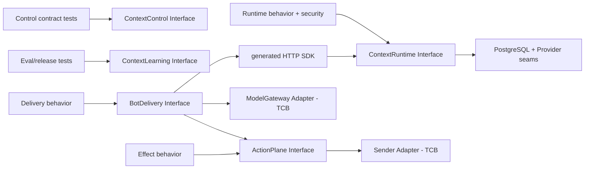
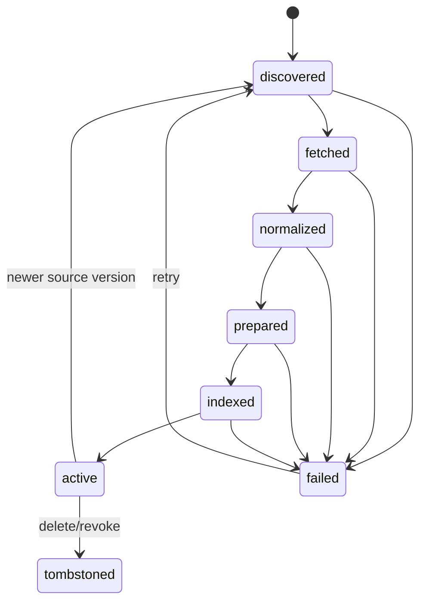
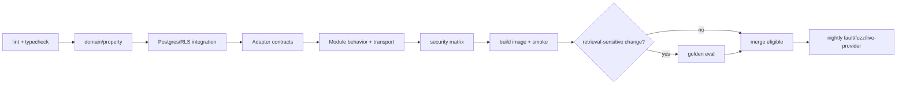

# Context Engine — Test Architecture 与可验证性设计

## Core Idea

> Context Engine 的最高 test surface 应与 ContextControl、ContextRuntime、ContextLearning、BotDelivery、ActionPlane 的 Module Interface 重合。用 contract suite 验证 Adapter，用真实 Postgres 验证授权与状态机，用 vertical slice 验证 HTTP/generated SDK；授权前 CandidateRef 必须content-free，Runtime content consumer只接AuthorizedProjection，生成ModelGateway只接由单一当前ContextPackage派生的AuthorizedModelInput与匹配EgressGrant。Security、Reliability、Quality、Budget与Ops readiness独立报告，避免一个端到端绿灯掩盖另一层失败。

## Content

ContextEngine 的测试架构从自有威胁模型推导：租户隔离、授权前后类型边界、发布原子性、可重放工作租约、audience-bound delivery 以及 egress/effect 权限分离都是发布 veto，不由上游测试数量或 UI 交互间接证明。四个公开参考仓只提供可核验的工程形状，包括 Adapter/contract、parser/retrieval fixture、preview/confirm 和真实依赖测试分层；取舍边界见[Four Public Repositories Evidence Baseline](../research/2026-07-19-four-public-repositories-evidence.md)。这些证据不代表 ContextEngine 已经完成动态 Spike 或安全验证。

推荐接受两项代价：V1 的 security、RLS、composite FK、outbox 与 pgvector 集成测试默认启动真实 PostgreSQL 17 + pgvector，速度慢于纯 in-memory test；PGLite 最多承载不涉及 role、RLS、extension 和 connection-pool context 的快速 Adapter 反馈，不计入安全门禁。任何新 Adapter 必须通过共享 contract suite，接入速度会被 gate 限制。换来的确定性是：tenant isolation、outbox、RLS、retrieval filter 和 ContextPackage contract 不依赖某个调用点的自觉。

“无 mock 能力声明”不等于禁止测试替身：deterministic fixture、fake、twin 和 spy 可以验证内部边界、故障语义与调用零效果，但不能代替真实 PostgreSQL、真实 wire、真实 source sandbox 或真实依赖的 capability evidence。只有后一类证据可以支持“能力已验证”的结论。

> **测试数量跟稳定行为增长，不跟内部 class/function 数量增长。**

### 1. Testing doctrine

目标代码库采用 10 条规则：

1. **Interface 是 test surface**：caller 与测试穿过同一 seam；内部 refactor 不改 behavioral test。
2. **真实安全底座优先**：Postgres RLS、composite FK、transaction、outbox 不用 repository fake 作为能力证明。
3. **Adapter 跑共享 contract**：ContextProvider、parser、HTTP/MCP ingress、ModelGateway与Sender的production/twin实现满足各自Interface；V1 PostgreSQL retrieval只保留内部候选注入测试seam，不虚构external-index portability。
4. **authorization 与 relevance 分开**：权限错误是 hard fail；相关性退化是 quality fail，不能互相平均。
5. **deterministic core，probabilistic edge**：policy compilation、fusion、budget、state transition 使用纯函数；LLM/parser/reranker 通过 recorded fixture 或 external eval。
6. **negative case 先于 happy-path scale**：missing tenant、wrong membership、stale policy、guessed ID、replay、cache hit、index leak 先全部 fail closed。
7. **每次发布固定 baseline**：schema、Adapter version、model/index config、golden dataset 与 threshold 一起进入 release manifest。
8. **production path 进入 eval**：评测通过 HTTP/SDK Interface 走真实 middleware/AuthorizationKernel，不直接调用内部 retriever。
9. **authorization前无content**：CandidateRef只能携带opaque identity、revision locator与非敏感rank signal，不携带title/snippet/body/field value或可逆content payload；SourceProjectionBatch先由AuthorizationKernel校验并产出AuthorizedProjection，Runtime content work才开始。
10. **能力覆盖不是布尔装饰**：版本化catalog预注册applicability/applicableFrom，capability activation/coverage单独报告，active path才产生PASS/FAIL。渲染态虽仍只有`PASS`、`FAIL`、`NOT_ACTIVE`、`NOT_APPLICABLE`，但active未运行/未映射=FAIL，required exit只能PASS。

> **一个 fake-only security test 没有证明数据库会拒绝越权 SQL。**

### 2. Deep Module 与最高 test surfaces



系统暴露 Control、Runtime、Learning、BotDelivery 和 ActionPlane 这组 deep Module；前三者属于 engine，后两者属于受信交付与效果面：

```ts
interface ContextControl {
  registerSource(command: RegisterSource): Promise<SourceRef>
  changeAccess(command: ChangeAccess): Promise<PolicyEpoch>
  changePolicy(command: ChangePolicy): Promise<PolicyEpoch>
}

interface ContextRuntime {
  resolve(
    invocation: AuthenticatedInvocation,
    delivery: TrustedDeliveryContext,
    request: Acquire | Continue | OpenCitation
  ): Promise<ResolutionOutcome>
}

interface ContextLearning {
  evaluate(candidate: ReleaseCandidateRef): Promise<ReleaseEvaluation>
  promote(command: TrustedPromotionCall): Promise<PromotionReceipt>
}

interface BotDelivery {
  answer(turn: VerifiedQuestionTurn): Promise<DeliveryReceipt>
  openCitation(open: VerifiedCitationOpen): Promise<CitationOpenOutcome>
}

interface ActionPlane {
  prepare(intent: TrustedEffectIntent): Promise<ActionPreparationOutcome>
  perform(payload: EffectPayload, ticket: ActionTicket): Promise<ActionExecutionOutcome>
}
```

`ContextLearning.promote`是唯一ReleaseManifest激活/回滚入口；初始empty manifest也走同一路径，ContextControl和migration无直接active-pointer写。CurationProfile显式引用可选CurationSnapshotRef、兼容Revision集与evaluation digest。

测试不会直接调用内部retrieval repository来证明ContextRuntime正确。它通过`resolve(Acquire | Continue | OpenCitation)`断言replacement Package、decisionRef与audit；Provider/retrieval内部seam另测语义。远程BotDelivery只通过认证metadata传每resolve独立的opaque DeliveryEvidenceRef，由ingress兑换TrustedDeliveryContext；它不能自报raw audience。Runtime内部content work只接AuthorizedProjection，BotDelivery生成边界只从一个当前audience-bound ContextPackage构造AuthorizedModelInput。ActionPlane以prepare/perform closed outcome表达deny、audience drift、幂等receipt与reconciliation。任何TCB边界都有spy/receipt负向测试。

> **外部 Interface 少，内部 Adapter contract 精确；两层测试不互相越界。**

### 3. Test portfolio

| Suite | 目标 | 依赖 | 触发频率 | 失败含义 |
|---|---|---|---|---|
| Domain property | authorization intersection、budget、state machine | pure/in-memory | 每次 commit | core invariant 破坏 |
| Postgres integration | schema、RLS、FK、transaction、outbox、revocation epoch | real Postgres | 每次 commit | source of truth 不安全 |
| Adapter contract | ContextProvider/parser/HTTP ingress/ModelGateway/Sender | production + deterministic twin | 每次 Adapter change | seam 语义漂移 |
| Module behavior | Control/Runtime/Learning/BotDelivery/ActionPlane observable outcome | local stack | 每次 commit | caller contract 破坏 |
| Security matrix | org/user/membership/agent/purpose/resource combinations | real DB + fake providers | 每次 commit + nightly fuzz | 越权或存在性泄漏 |
| Audience/egress conformance | TrustedDeliveryContext、DeliveryEvidenceRef、AudienceSnapshot、EgressGrant、群历史策略 | trusted identity/delivery twins + model/sender spies | 每次 commit | TCB边界或发送授权破坏 |
| Reliability | retry/replay/crash/out-of-order/delete/reconcile | real DB + controllable worker/retrieval/Provider | nightly | 最终一致性/恢复语义破坏 |
| Retrieval eval | Hit@K、MRR、NDCG、Recall、freshness | frozen corpus + configured index | PR when retrieval changes | retrieval quality regression |
| Assembly eval | coverage、citation、token budget、trust/gap | frozen candidates + optional judge | PR/nightly | ContextPackage quality regression |
| Transport conformance | HTTP/generated SDK + auth metadata；MCP激活后再加入parity | local server | 每次 commit | transport 泄漏 policy 或 contract drift |
| Deployment smoke | migrate、start、ready、worker lease、one query | packaged image | release candidate | artifact 不可运行 |

不建议追求一个全局 coverage 数字。更有用的 gate 是：security invariant 全量枚举、所有已激活 Adapter contract 全过、所有 schema migration 有 forward/rollback fixture、golden eval 满足实验前冻结的 slice threshold 与 uncertainty/power plan。每个 invariant 分开记录预注册 applicability、capability activation/coverage 和当次 active result。对外渲染态仅为 `PASS`、`FAIL`、`NOT_ACTIVE`、`NOT_APPLICABLE`；active 但未运行、未映射或缺证据必须是 `FAIL`。每个 milestone 的 required exit 只接受当次 `PASS`，其他两个状态只说明边界，不能替代验收。

> **Coverage 是诊断信号；contract 与 invariant 才是发布门槛。**

### 4. Security invariant catalog

发布目录的唯一机器权威是 [`eval/catalogs/security-invariants.yaml`](../../eval/catalogs/security-invariants.yaml)，其 schema 是 [`eval/catalogs/security-catalog.schema.json`](../../eval/catalogs/security-catalog.schema.json)，验证命令是 `python3 scripts/validate_security_catalog.py`。它使用 JSON-compatible YAML，使 D0 在尚无依赖清单时可由 Python 标准库完成确定性验证。[ADR-0019](../decisions/0019-security-catalog-normalization.md) 固定恰好 15 个 canonical release ID。每条 invariant 同时拥有适用的 domain property、Postgres integration 与 runtime/delivery negative evidence；任何 required seam 失败都阻止发布。

| ID | Invariant | 最小测试 |
|---|---|---|
| `TENANT-OWNERSHIP-001` | 每个 tenant-owned row/blob/index/job/trace/package 有 Organization | insert missing org 被 schema/type 拒绝 |
| `TENANT-FK-002` | child 不能引用另一 Organization 的 parent | composite FK cross-org insert 失败 |
| `RLS-FAIL-CLOSED-003` | missing tenant session 不返回/不写 tenant data | non-owner runtime role query=0，write error |
| `SCOPE-INTERSECTION-004` | request 与 Agent 只能收窄 Principal scope | property-based arbitrary narrowing，result set 单调不增 |
| `INDEX-NOT-AUTHORITY-005` | content-free CandidateRef必须经Kernel authorize/project后才可进入Runtime content work；生成model只接BotDelivery构造的AuthorizedModelInput | fake retrieval返回cross-org ID/snippet，Runtime content consumer与ModelGateway的denied bytes均为0 |
| `REVOCATION-006` | engine观察到access change后先bump Policy Epoch，下一请求失效 | cache/index未清理仍不可见；已发送bytes由独立egress历史策略处理 |
| `WORKER-LEASE-007` | ServiceActor/WorkerLease精确绑定org、job、operation、source、可选resource/revision、workload、epoch、可选audience、idempotency、generation、iat/exp、nonce | 逐claim变异、durable job row不匹配、过期、旧generation、replay或伪装UserActor均拒绝 |
| `TRANSPORT-UNTRUSTED-008` | HTTP/MCP body不能自报org/user/audience/ACL/raw SQL/bypass；SDK只是HTTP client artifact | schema拒绝trusted字段，ingress仅从认证会话或已兑换DeliveryEvidenceRef构造context |
| `NON-ENUMERATION-009` | missing 与 unauthorized 对 caller 等价 | status/body/latency bucket 无资源存在性差异 |
| `CITATION-AUTH-010` | CitationOpenRef不授予权限且每次open授权；ContinuationToken独立、scope-bound且one-shot | 两类token不可互换；wrong opener/revoke后返回0 bytes |
| `EGRESS-011` | sensitivity/purpose/provider/region/audience做交集，TCB逐跳验证egress grant | disallowed ModelGateway/Sender receives zero payload/effect |
| `TRACE-REDACTION-012` | ContextRun只含authorized refs；restricted DecisionAudit不含raw denied content | tenant-visible run/debug无raw denied；security audit只有opaque digest/category |
| `ACTION-SEPARATION-014` | Context read不能授予write；外部效果只经ActionPlane.prepare/perform的closed outcome，create/finalize是不同one-shot effect | bypass prepare、wrong/cross-effect/replayed ticket为business effect=0；成功replay返回存量receipt，ambiguous attempt以原id对账 |
| `CROSS-ORG-LEARN-015` | V1 无跨租户 raw learning | feedback/eval export 按 org；global artifact raw refs 为空 |
| `RELEASE-OWNER-019` | ContextLearning.evaluate/promote是唯一ReleaseManifest评测与激活路径 | Control/curation/bootstrap直写active pointer=0；初始manifest只经promote |

归并只消除重复的发布标签，不消除证明义务：原 `AUDIENCE-016` cases 由 `SCOPE-INTERSECTION-004` + `EGRESS-011` 承担，原 `ACL-PROOF-017` cases 由 `INDEX-NOT-AUTHORITY-005` + `REVOCATION-006` 承担，原 `DELIVERY-EVIDENCE-018` cases 由 `TRANSPORT-UNTRUSTED-008` 承担。`CACHE-SCOPE-013` 是 canonical 15 之外的预注册条件扩展；当前 composition test 必须证明 authorization-sensitive 的最终 `ContextPackage`/`AuthorizedProjection` cache 不可达。首次激活时必须先用版本化 catalog/schema 变更加入该扩展及完整 cache-key mutation suite，且当次结果只能以 `PASS` 开门。所有既有 test cases 保留，ID 不重排、不复用。

> **Security suite 的目标是证明数据无法进入 Evidence，不是最终答案碰巧没显示它。**

### 5. Property-based authorization tests

核心公式适合 property test：

```text
EffectiveScope
  = OrganizationBoundary
  ∩ MembershipRights
  ∩ PrincipalGrants
  ∩ AgentDelegationCeiling
  ∩ SourceNativeACL
  ∩ ResourceACL
  ∩ PurposePolicy
  ∩ (RequestNarrowing when present)
```

前七个 trusted scope operand 全部必需，缺少任一个都 fail closed。`RequestNarrowing` 只是caller的可选额外收窄；未提供时等价于不增加额外过滤，不属于missing authorization context。

生成随机 Organization、Principal、Membership、Group、Agent、Resource 和 grant graph，至少验证 6 个性质：

1. 交换输入集合的顺序不改变 EffectiveScope；
2. 任一 grant 缩小，EffectiveScope 不增；
3. 任一必需 trusted scope operand 缺失或为空，结果为空；
4. Agent ceiling 增大不能超过 Principal/Resource/Source scope；
5. request 加 filter 不能新增 Resource；
6. policy epoch 改变后旧 decision/cache/lease 不再有效。

群audience property generator另外随机生成成员加入、退出、未绑定身份、外部成员与snapshot freshness，验证：public scope不大于所有已解析受众scope交集；任何未知成员都使public delivery fail closed；private asker scope不能被事后切分为public scope；send-time snapshot只能收窄或触发重新resolve。

这些测试只验证 AuthorizationKernel 的纯逻辑。随后用同一 generated case 写进 Postgres，验证 RLS/query/hydration 的实际结果与 kernel oracle 一致。

> **纯函数给 oracle，真实数据库证明 enforcement。**

### 6. Postgres/RLS integration harness

默认 CI 使用真实 PostgreSQL 17 + pgvector；测试使用non-owner、`NOSUPERUSER NOBYPASSRLS NOINHERIT` runtime/worker role，禁止superuser/owner绕过RLS。每个request或worker operation使用一个明确事务；事务开始先transaction-locally绑定Organization与closed `ActorContext`，再校验context，此后才允许ORM autoflush、query或Provider/retrieval工作。Organization可通过`SELECT set_config('app.organization_id', :organization_id, true)`（等价于`SET LOCAL`）绑定，policy用`current_setting('app.organization_id', true)`读取；缺失Organization、ActorContext或必需actor binding时必须default deny。在线request使用含authenticated Principal/Membership的`UserActor`；worker使用注册、最小权限的`ServiceActor`，不借用触发用户身份。每个case在事务中：

1. seed 两个 Organization、两个 User、三个 Membership、一个 Agent；
2. seed 同名 Resource/Fragment，ID 尽量可猜；
3. 设置 session invocation context；
4. 从 repository、raw SQL view、FTS/pgvector query 各走一次；
5. 断言 only EffectiveScope；
6. bump policy epoch 后重复，不清 index/cache；
7. rollback fixture。

必须单独测试：

- table owner 与 runtime role 行为不同；
- runtime role明确不是table owner、superuser且没有`BYPASSRLS`；
- `FORCE ROW LEVEL SECURITY` 生效；
- transaction-local context在commit/rollback后消失，connection pool不能继承前一个tenant；
- transaction/async worker 丢 context 时 fail closed；
- WorkerLease绑定Organization、job、operation、source、可选resource/revision、ServiceActor/workload、policy epoch、可选audience、idempotency、lease generation、iat/exp与nonce，兑换时逐项核对durable job row；
- 任一WorkerLease claim变异、过期、旧generation、跨job/resource/revision或replay都拒绝；
- security definer function 不越权；
- schema security manifest把**每一张表**显式分类为global或tenant，未分类表阻止migration；
- manifest中的tenant表必须有organization key、composite ownership约束、RLS policy、`FORCE ROW LEVEL SECURITY`与负向fixture；
- unique/index/FK 都以 organization 为 prefix 或 composite part。

> **RLS 测试的第一个 fixture 是“没有设置 tenant”，预期不是 default tenant，是零结果或错误。**

### 7. Adapter contract suites

#### 7.1 `ContextProvider` contract

production Provider implementation 与 deterministic twin 运行同一 suite：

- V1只暴露`describeCapabilities`、`readChanges`、`discover`、`authorizeAndProject`四个typed只读操作，其他方法不是contract；
- 四个操作统一返回closed `ProviderOutcome = Ok | Unsupported | RetryableUnavailable | InvalidCheckpoint | GenericDenied`，unsupported/denied/unavailable不伪装成empty success；
- `describeCapabilities()`的版本、Resource kind、ACL mode、projection field、cursor/delete/batch/freshness/consistency声明与真实behavior一致；
- ContextAccessTicket的audience/expiry/organization/subject全验证，typed query拒绝未声明field/operator；
- `discover()`只返回content-free stable CandidateRef，不返回title/snippet/body/field value或可逆content payload；
- `authorizeAndProject()`返回的`SourceProjectionBatch`是Kernel待验证证据，不是Provider或caller可直接构造/信任的`AuthorizedProjection`；
- `CandidatePage` 与 `SourceProjectionBatch` 共享`SourceConsistencyRef`；provider、SourceVersion、ACL mode、decision/snapshot、asOf缺失、混用、变化或过期时Kernel拒绝；
- ACL proof必须声明为`live`、`mirrored`或`weak`：live在本次resolve按current subject检查；mirrored绑定`aclAsOf/sourceVersion`并满足声明SLA；weak仅用于source原生缺少细粒度ACL且敏感类型default deny；
- 声明strong ACL的Provider在ACL timeout/429/5xx时fail closed或返回typed gap，不能切换为weak；
- ACL change在live proof下一次authorizeAndProject立即反映；mirrored proof只承诺到明确as-of/SLA，超期不得继续；
- not-found/denied 等价；
- `readChanges()` checkpoint 在SourceVersion内单调，page持久接收后才推进，重放幂等；
- FileProvider只使用PostgreSQL中版本化、随File Source激活的`FileSourceAccess`作为Mirrored SourceAclEvidence；缺失、不完整或未知grant严格deny，不从OS owner/mode/ACL推断也不默认public。

#### 7.2 PostgreSQL retrieval implementation seam

V1 retrieval固定为PostgreSQL FTS+pgvector。内部candidate-injection seam只用于安全oracle与deterministic ordering测试，不是对外Index Adapter contract，也不承诺external-backend portability。真实PostgreSQL suite验证：

- upsert 同 Revision 幂等；
- activate 前不可搜；
- organization/policy candidate filter 必填；
- keyword/vector/fusion deterministic fixture ordering；
- delete/tombstone 不召回；
- stale candidate 可被 runtime exact auth 清掉；
- search结果的CandidateRef没有正文、snippet、字段值或embedding payload；content-bearing rerank只能消费AuthorizedProjection；
- lexical/vector/RRF score的归一化和ordering是当前PostgreSQL implementation contract，不压成虚构的最低公分母；
- query timeout/cancel 不留下 partial state。

#### 7.3 Queue/Worker contract

- outbox transaction commit 前不投递；
- dispatcher 重复投递只执行一次 business effect；
- retry 保留同 idempotency key、增加 attempt；
- out-of-order revision 不能覆盖 active newer revision；
- worker只使用注册且最小权限的ServiceActor，不伪装触发UserActor；
- WorkerLease的org/job/operation/source/resource/revision/workload/epoch/audience/idempotency/generation/iat/exp/nonce逐项与durable job row匹配；
- expired/wrong-audience/wrong-generation/replayed WorkerLease 拒绝；
- crash at prepared/indexed/active 每一点可恢复；
- poison task 进入 dead letter，不能无限阻塞 Organization queue。

#### 7.4 Transport contract

HTTP是V1 server transport，generated SDK是HTTP caller artifact；MCP只在真实caller激活后进入同一canonical Package conformance suite。Transport只负责authentication binding、schema、stream/error mapping，不得自行构造ACL/filter或删Evidence。Untrusted body不能携带`TrustedDeliveryContext`、purpose、AudienceSnapshot、Organization、Principal或EgressGrant。本地trusted ingress可从已验证session/token/mTLS/OAuth binding与认证route/application policy构造`AuthenticatedInvocation + TrustedDeliveryContext`；remote BotDelivery每次resolve只在认证transport metadata传一个opaque `DeliveryEvidenceRef`，ingress校验service/request/org/asker/destination/purpose/audience/expiry后兑换。public与asker-private resolve使用不同ref，raw purpose/audience claims不进body。

#### 7.5 Egress 与 Action contract

BotDelivery、ModelGateway、ActionPlane和Sender分别运行共享TCB负向suite：

- BotDelivery只能向trusted identity Adapter请求DeliveryEvidenceRef，不能提交EffectiveScope/raw audience claims或把asker-private Package切分为public；
- group public与asker private必须是两次独立audience-bound resolve；未知、外部、未绑定成员使public path fail closed；
- BotDelivery只能从一个当前、audience-bound ContextPackage及匹配purpose/retention policy构造`AuthorizedModelInput`；ModelGateway只接收该类型与匹配model EgressGrant，无grant或wrong provider/region/audience/digest时payload为0；
- Sender在最终发送前重新读取或验证AudienceSnapshot；resolve后成员变化、超时或stale snapshot时不发送群bytes；
- 如果未来成员能读取历史消息，public evidence必须对潜在历史读者安全；否则验证删除/redaction补偿或改发private；
- `prepare(TrustedEffectIntent)`只返回`Prepared | GenericDenied | AudienceChanged | RetryableUnavailable(effect zero)`，`perform(EffectPayload, ActionTicket)`只返回`Applied | AlreadyApplied(stored receipt) | Rejected(effect zero) | ReconciliationRequired`；
- placeholder `create`与answer `finalize/edit`使用不同effect、不同one-shot ActionTicket/idempotency key，仅共享delivery attempt lineage；任一ticket不能兑换另一effect，成功replay只返回存量receipt，ambiguous external attempt必须在原id下对账，不换新ticket重试。

> **一个 Adapter 通过自己的 happy path 不够；它必须通过该 seam 的共享失败语义。**

### 8. Ingestion state-machine tests

目标 publish protocol：



状态测试不 assert 内部 method call，assert observable ledger：active Revision、search visibility、outbox records、SyncRun state、audit、retry count。

故障注入点至少有 10 个：fetch 前后、normalize 前后、Revision commit 后、index batch 中、index 完成/state 更新前、active swap 前后、delete index 前后、worker ack 前。每次 crash/retry 后必须满足：最多一个 active Revision；旧 active 在新 active 前保持可用；tombstone/policy revoke 例外，必须优先不可见。

> **内容更新追求无空窗发布，撤权追求先不可见；两者使用不同优先级。**

### 9. Runtime behavior tests

`ContextRuntime.resolve(AuthenticatedInvocation, TrustedDeliveryContext, Acquire | Continue | OpenCitation)`的table-driven cases如下。HTTP body（以及未来激活的MCP arguments）只携带closed request union，trusted ingress注入`AuthenticatedInvocation`并构造或兑换`TrustedDeliveryContext`，三者不能在untrusted wire object中扁平合并。

| 场景 | 预期 Package |
|---|---|
| 无结果 | blocks/evidence 空，gaps 指明 no-authorized-evidence，不泄露 denied count |
| materialized | content-free CandidateRef→authorizeAndProject→AuthorizedProjection→content rerank→budget assemble |
| federated | typed provider query→CandidatePage/SourceProjectionBatch共享SourceConsistencyRef→Kernel校验后构造AuthorizedProjection，带proof kind、asOf/freshness |
| hybrid | PostgreSQL retrieval定位 Resource→source authorizeAndProject/Kernel校验→fresh fields |
| stale index candidate | 丢弃，coverage/gap 可记录通用 stale，不暴露资源名 |
| partial provider timeout | 允许 partial package，gaps 标 provider unavailable，decisionRef 完整 |
| budget overflow | deterministic truncation，citation/evidence 同步裁剪 |
| continue scope | child offer scope是parent scope子集；denied candidate不能mint offer；不能换org/purpose/source/target |
| continue budget | token/call/cost按parent remaining单调扣减；latency按per-call ceiling取min，不作为累计余额 |
| continue audience/replay | wrong consumer/session audience在provider前拒绝；同token并发兑换最多一次effect |
| epoch revocation | Policy Epoch变化后旧continuation直接拒绝，provider/index调用0；新acquire重新决策 |
| live decision drift | epoch未变但source ACL/freshness变化时，成功replacement Package移除旧Evidence |
| replacement semantics | response是带新package/run lineage的self-contained Package；旧Package可丢弃，无delta与dangling ref |
| egress deny | Runtime不将Package body发给外部；BotDelivery无法构造有效AuthorizedModelInput/EgressGrant，model/sender bytes=0 |
| strong ACL unavailable | fail closed或typed provider-unavailable gap；绝不改用weak proof |
| group public/private | Kernel基于trusted AudienceSnapshot分别resolve；public Package是全员交集，asker private是独立Package |
| future member/history | history policy不能证明安全时不发public evidence；可验证删除/redaction或private delivery |
| send-time drift | Sender复核snapshot；成员变化/未知/超时时群effect=0，必要时重新resolve |
| citation open | CitationOpenRef可多次定位，但每次按opener/current policy exact authorize；ref本身无authority |
| continuation | ContinuationToken绑定principal/audience/scope/budget且one-shot；不能作为CitationOpenRef使用 |

Clock、ID、Policy Epoch、token counter、Provider/retrieval、AudienceSnapshot reader、ModelGateway与Sender都注入controllable Adapter/spy。LLM query rewrite/rerank不参与core behavior test，Runtime使用只接受`AuthorizedProjection`的deterministic fixture；真实模型变化进入eval suite。architecture/import test确保raw CandidateRef/SourceProjectionBatch无法到达Runtime content rerank或Assembler，也无法被BotDelivery传给ModelGateway；ModelGateway类型边界只接`AuthorizedModelInput`。

> **Runtime test 断言 Package 与 audit，不断言内部调用顺序，除非顺序本身是安全 contract。**

### 10. Retrieval 与 assembly evaluation

Quality gate 分四层：

| 层 | 指标 | Dataset |
|---|---|---|
| routing/planning | source selection accuracy、forbidden source selection=0 | scenario→allowed/expected Source |
| retrieval | Hit@K、MRR、NDCG@K、Recall@K、fresh-hit rate | query→Resource/Fragment judgments |
| assembly | evidence precision、coverage、duplication、token utilization、citation completeness | candidate set→expected evidence constraints |
| security | unauthorized Evidence/model payload/send effect=0、stale/revoked Evidence=0 | adversarial org/membership/resource/audience matrix |

security 指标不能用平均分；一次 unauthorized Evidence 就是 release fail。retrieval/assembly 的slice threshold、baseline tolerance、latency/cost budget、failure-category coverage与uncertainty/power目标必须在实验前预注册；样本不足只能标记pilot或inconclusive，不得事后设定固定题数或阈值来开门。LLM judge 只负责 graded relevance、faithfulness 等软指标；expected resource ID、ACL、citation mapping 用 deterministic evaluator。

每个 experiment 记录：commit、schema version、Adapter/config/model/index version、dataset version、raw result、threshold 与 cost。历史分数不跨 baseline 继承。

> **Judge 可以评价相关性，不能决定越权是否发生。**

### 11. Contract snapshots 与 schema evolution

需要 snapshot 的只有稳定外部 artifacts：

- `ResolutionRequest`、`ContextPackage`、`ContinuationOffer` JSON Schema；
- `ContinuationToken`与`CitationOpenRef`的不同wire variant、key purpose、audience与audit shape；
- HTTP OpenAPI，以及真实caller激活后的MCP tool schema；
- `AuthenticatedInvocation`/`TrustedDeliveryContext`/`AudienceSnapshot` server-side contract，以及authenticated metadata中opaque `DeliveryEvidenceRef`的binding/redemption shape；
- `ActorContext`/`ContextAccessTicket`/`WorkerLease`与create/finalize `ActionTicket` claims；
- `ActionPreparationOutcome`/`ActionExecutionOutcome`的closed union、stored receipt与reconciliation shape；
- `ReleaseManifest`、`CurationProfile`及其可选`CurationSnapshotRef`/compatibility/evaluation lineage；
- tenant-visible `ContextRun`与restricted `DecisionAudit`的不同redacted shape；
- database migration manifest、全表schema security manifest与RLS coverage report。

`ResolutionRequest` snapshot使用`oneOf`与`unevaluatedProperties: false`。negative fixtures覆盖unknown kind、同时携带need+continuation、acquire携continuation、continue携need，以及organization/principal/purpose/audience/ACL/raw SQL/bypass等trusted字段；HTTP与generated SDK必须得到相同schema failure，MCP激活后再加入同一fixture。

不 snapshot internal SQL、prompt 全文或 class tree。Schema evolution test 读取 N-1 fixture，验证 upcast；新 consumer 读取旧 Package，旧 consumer 遇到新增 optional field 不失败。breaking change 必须新 major contract version 与 dual-read window。

> **Snapshot 固定 caller 必须知道的 Interface，不能冻结 Implementation。**

### 12. CI pipeline



PR 必跑 deterministic suite，其时间预算由版本化CI policy维护，不在设计文档硬编可变数值。retrieval/parser/model/index 改动额外跑 frozen eval。nightly 执行 property fuzz、fault injection、live provider conformance、large corpus performance。release candidate 在与 production 等价的 non-owner role 与 packaged image 上跑最小多租户场景。

CI生成machine-readable invariant/capability report；catalog在run前预注册applicability、`applicableFrom`和required gate，capability activation/coverage另行报告。active且已运行才可能`PASS`，失败或active但未运行/未映射/缺证据都是`FAIL`；未激活为`NOT_ACTIVE`，在冻结catalog中已附审批理由的结构性不适用项才是`NOT_APPLICABLE`。milestone required exit 只接受当次`PASS`；`NOT_ACTIVE/NOT_APPLICABLE`不能替代也不得汇总为passed coverage。

M5 engineering gate `E5` 只由Security、Reliability、Quality、Budget四类必需报告全绿与Ops readiness满足才通过，不依赖design partner。`L1` 是E5之后独立的business gate，覆盖partner agreement、legal、naming与commercial approval，不能反向充当工程验收证据。

Flaky test 不能自动重跑后变绿；先记录原始失败，只有 typed external-transient suite 可有限 retry。任何 security/reliability deterministic test flaky 都视为产品 bug。

> **CI 的顺序先证明隔离，再证明质量，最后证明 artifact 可运行。**

### 13. V1 acceptance scenarios

同一个 Agent、同一句 Query，canonical 最小 fixture 固定为以下 12 个具名顶层场景：

| Acceptance ID | 顶层场景 | 必需断言 |
|---|---|---|
| `ACCEPT-001` | cross-Organization isolation | Organization A/User A 只得到 A 的 Resource/field，Organization B/User B 只得到 B；同一 fixture 双向参数化断言，cross-org Evidence/effect 均为 0 |
| `ACCEPT-002` | same-Organization Membership isolation | 同一 Organization 的 Membership A/B 得到不同 Resource/field |
| `ACCEPT-003` | Agent ceiling intersection | Agent ceiling 比 User 小时只返回交集 |
| `ACCEPT-004` | request narrowing | request source/filter 只能收窄，不能扩大 trusted scope |
| `ACCEPT-005` | revocation | revoke 后下一次 request、旧 cache、旧 continuation 均不可见 |
| `ACCEPT-006` | hostile index candidate | index 故意返回 cross-org candidate 仍不进入 AuthorizedProjection/Evidence 或 content-bearing consumer |
| `ACCEPT-007` | transport injection rejection | HTTP body 自报 org/ACL/raw SQL 被 schema 拒绝；MCP 激活后同一 fixture 也必须拒绝 |
| `ACCEPT-008` | WorkerLease replay and binding | Worker 使用 ServiceActor；WorkerLease 每个 claim 与 durable job row 匹配，wrong-org/generation/workload/job/source/operation 与 replay 被拒绝 |
| `ACCEPT-009` | source-native ACL | federated Provider 对 source-native ACL 做最后授权，proof 不可静默降级 |
| `ACCEPT-010` | citation revocation | citation/open-original 在 revoke 后失败且不暴露存在性 |
| `ACCEPT-011` | denied/not-found equivalence | cross-org、same-org denied 与 missing reference 的 status/body/error/shape/count 等价；milestone-scoped timing case按预注册门槛执行 |
| `ACCEPT-012` | Context/Action separation | Context 与 Action 使用不同 audience/capability，read authority 不产生 write effect |

早期编号 13–22 不是额外顶层 acceptance ID，而是下面这些仍然必跑的参数化/派生案例或 invariant evidence：

| 历史编号 | 保留的证明义务 | 映射 |
|---|---|---|
| 13 | CandidateRef没有content；Runtime rerank/Assembler只接AuthorizedProjection；ModelGateway只接由单一当前Package构造的AuthorizedModelInput与匹配EgressGrant | `ACCEPT-006`；`INDEX-NOT-AUTHORITY-005`、`EGRESS-011` |
| 14 | strong ACL proof故障不降为weak；mirrored/weak Package暴露proof kind与freshness | `ACCEPT-009`；`INDEX-NOT-AUTHORITY-005`、`REVOCATION-006` |
| 15 | caller不能伪造TrustedDeliveryContext/AudienceSnapshot；DeliveryEvidenceRef伪造、跨request重放、wrong service/destination或过期均在content work前失败；未知成员不产生public Package | `ACCEPT-007`；`TRANSPORT-UNTRUSTED-008`、`SCOPE-INTERSECTION-004`、`EGRESS-011` |
| 16 | 群公开与asker私聊是两次resolve；send-time成员变化与future-member history策略fail closed | `ACCEPT-012`；`SCOPE-INTERSECTION-004`、`EGRESS-011` |
| 17 | CitationOpenRef与ContinuationToken不能互换；前者每次按opener授权，后者one-shot | `ACCEPT-010`；`CITATION-AUTH-010`、`NON-ENUMERATION-009` |
| 18 | create/finalize各经ActionPlane.prepare/perform closed outcome、各自最多一个对应effect；成功replay返存量receipt，ambiguous attempt用原id对账 | `ACCEPT-012`；`ACTION-SEPARATION-014` |
| 19 | ContextRun只含authorized lineage；DecisionAudit对tenant caller不可见且无raw denied body | invariant evidence；`TRACE-REDACTION-012` |
| 20 | 每张数据库表进入schema security manifest；tenant表由non-owner/NOBYPASSRLS role在transaction-local Organization+ActorContext下证明隔离 | `ACCEPT-001`、`ACCEPT-002`；`TENANT-OWNERSHIP-001`、`TENANT-FK-002`、`RLS-FAIL-CLOSED-003` |
| 21 | FileProvider只使用active、版本化FileSourceAccess；missing/incomplete/unknown grant严格deny，不从OS owner或默认public推断 | `ACCEPT-009`；`INDEX-NOT-AUTHORITY-005`、`REVOCATION-006` |
| 22 | 初始empty ReleaseManifest只由授权release operator经`ContextLearning.promote`激活；bootstrap/migration/ContextControl直写active pointer失败 | invariant evidence；`RELEASE-OWNER-019` |

这 12 个顶层场景组成 V1 release smoke fixture；派生案例和 invariant evidence 不增加顶层计数，也不得遗漏。每个milestone只对它明确列为required的已激活项要求`PASS`。未激活路径必须标`NOT_ACTIVE`并证明不可达，但该状态不能完成required exit；不得以“未来补security suite”或未实现即通过。

> **最小产品可以先只支持一个File Source，最小安全模型不能只支持 happy path。**

### 14. 四个公开参考仓的可核验测试输入

| 项目 | 吸收 | 拒绝/补强 |
|---|---|---|
| Dify | provider/vector/node 的 Adapter 思路、preview/hit test | 配置组合必须有 contract matrix；tenant filter 不能分散到 Adapter |
| RAGFlow | parser/retrieval benchmark、rich document fixture | parser quality 与 tenant security 分开 gate；runtime parity 要 contract |
| MaxKB | preview/confirm、Hit Test、direct return、human correction | 自动化 contract/golden/security release gate 由 ContextEngine 自建 |
| Onyx | connector/checkpoint、分阶段索引与真实依赖测试分层 | missing tenant 不允许 default fallback；ACL semantics 必须单值明确 |

这张表只记录固定版本中可回引的 observable behavior，不将上游的代码结构、安全保证或 edition 声明继承给 ContextEngine。具体 commit 与一手证据统一由[Four Public Repositories Evidence Baseline](../research/2026-07-19-four-public-repositories-evidence.md)管理。

Visible self-correction：早期设计把“多写一些 unit tests”当可测试性的主要答案。这个顺序是错的。正确顺序是先缩小 Module Interface、固定不变量与真实 seam，再让 unit/integration/eval 覆盖各自责任。否则测试会复制内部结构，重构一次就全部重写。

> **可测试性来自 Module shape；test count 只是结果。**

### 15. Failure signals 与 revisit triggers

以下信号出现任一项，暂停新增 retrieval feature：

- 一个 authorization rule 在两个以上 caller/transport 重复实现；
- unit test需要替换多个内部 Module 才能调用`resolve()`；
- security case 只能通过 UI e2e 复现；
- Postgres test 使用 owner/superuser；
- 新 Adapter 没有 in-memory/local test twin；
- eval 不能复现到 commit+config+dataset；
- ContextPackage schema 跟某个 vector/provider payload 同构；
- flaky retry 把 security/reliability failure 隐藏；
- release 只报告总分，没有 unauthorized evidence count；
- migration 创建 tenant-owned table 却没有 composite FK/RLS audit；
- schema security manifest存在未分类表，或只统计已经带`organization_id`的表；
- CandidateRef携带snippet/title/body/field value，或raw candidate可以进入content rerank/Assembler/ModelGateway；
- strong ACL Provider故障时切换到weak proof；
- BotDelivery自行计算群scope、从asker Package切出public结果，或Sender不做send-time audience复核；
- CitationOpenRef与ContinuationToken共用同一兑换语义，或create/finalize共用同一ActionTicket effect；
- ContextRun、tenant trace或learning export出现raw denied candidate/content。

重访触发：第二个 production Index Adapter、第二种 OrganizationPlacement、remote owned Provider 转 microservice、ContextPackage major version、或 security incident/finding。

> **当测试开始了解 Implementation 细节，先审 Module seam，再增加 test helper。**

## References

- [ADR-0019: Security catalog normalization](../decisions/0019-security-catalog-normalization.md)
- [Four Public Repositories Evidence Baseline](../research/2026-07-19-four-public-repositories-evidence.md)
- [PostgreSQL 17 Row Security Policies](https://www.postgresql.org/docs/17/ddl-rowsecurity.html)
- [ContextEngine implementation design](../design/2026-07-18-context-engine-implementation-design.md)

## Questions / Next Steps

- [x] 以 `eval/catalogs/security-invariants.yaml` 固定 canonical 15，并由 `python3 scripts/validate_security_catalog.py` 校验 schema、顺序、唯一性与文档引用；各 milestone 的 executable proving-case harness 仍随实现加入。
- [ ] 用 Testcontainers/Postgres 17 建 non-owner+FORCE RLS harness。
- [ ] 先写`ContextRuntime.resolve(Acquire | Continue | OpenCitation)`的in-memory behavior harness与真实Postgres security tests，再将它固定到HTTP/OpenAPI。
- [ ] 定义 V1 golden corpus：两个 Organization、同Organization两个Membership、File Source、后续Provider twin、撤权与stale candidate cases；样本计划按slice coverage与uncertainty/power预注册。
- [ ] 建identity/BotDelivery/ModelGateway/ActionPlane/Sender twins与spies，覆盖DeliveryEvidenceRef、AudienceSnapshot、AuthorizedModelInput、EgressGrant、future-member history与closed action outcomes。

## Revisit Notes

*Added 2026-07-15*: proposed test architecture。重访触发：目标代码库选定语言/框架、第一条 vertical slice 实现、或任何 Adapter contract 无法容纳真实 provider semantics。

*Updated 2026-07-18*: adopted implementation design冻结content-free CandidateRef→Kernel-only AuthorizedProjection→Runtime content work与Package→AuthorizedModelInput→ModelGateway两段类型顺序，收敛ContextProvider四操作、DeliveryEvidenceRef、ServiceActor/WorkerLease、closed ActionPlane outcomes、唯一Learning promotion与真实Postgres transaction/RLS全表manifest验收。

*Updated 2026-07-19*: 将测试论证收口到 ContextEngine 自有威胁模型与四个公开参考仓证据基线；明确 fixture/fake/twin 可以证明内部失败语义，但不代替真实依赖的 capability evidence。

*Updated 2026-07-20*: 依据 ADR-0019 将发布 catalog 固定为 15 个 canonical ID，归并重叠标签而不删除 case，并将 acceptance 口径收敛为 12 个顶层场景加历史 13–22 的派生/参数化证据。
