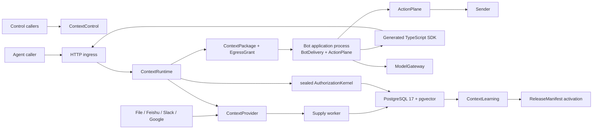
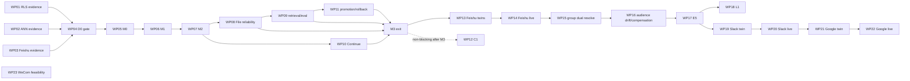

# ContextEngine Implementation Epic Specification

> This is the execution contract between the approved design and the future
> implementation backlog. It is subordinate to the implementation authority,
> accepted ADRs, and `CONTEXT.md`. It is versioned as a repository candidate,
> but it does not close D0, publish a GitHub issue, approve a release, or
> authorize an implementation agent to start.

## 1. Context

### 1.1 Why this matters

ContextEngine must deliver context that is authorized for the current audience,
traceable to evidence, bounded by cost and size, and revocable for future
controlled operations. The difficult product property is not retrieval alone. It
is preserving those guarantees across ingestion, PostgreSQL isolation, source ACL
evidence, retrieval, model egress, IM delivery, retries, learning, and connector
expansion.

The affected stakeholders are:

| Stakeholder | Required outcome |
|---|---|
| Tenant administrator | No Organization, Membership, source ACL, purpose, or audience boundary can be bypassed. |
| Agent developer | One stable `resolve` seam returns a self-contained `ContextPackage`; callers do not assemble security stages. |
| IM user | Private and group delivery disclose only content authorized for the actual delivery audience. |
| Connector developer | Every source declares and proves its capability and ACL semantics through one contract. |
| Release operator | Only an authorized `ContextLearning.promote` changes the active `ReleaseManifest`. |
| Security/operator team | Every release claim is backed by reproducible tests, artifacts, and operational evidence. |

### 1.2 Verified current state

Verified on 2026-07-19:

| Area | Current state | Evidence |
|---|---|---|
| Implementation | No runnable application or executable test suite exists. | `README.md`, repository tree |
| Design authority | Implementation Design v1.2 is authoritative; earlier drafts are non-authoritative history. | `docs/design/2026-07-18-context-engine-implementation-design.md:9` |
| Baseline | A byte-level candidate exists but is not approved and is not immutable. | `DESIGN-BASELINE.md:1` |
| Architecture | Five deep Modules and three processes by M2 are fixed. | implementation design sections 2 and 9 |
| Security | ADR-0019 fixes exactly fifteen stable release IDs in the machine catalog; overlapping labels retain their cases under canonical IDs, and the canonical fixture is `ACCEPT-001` through `ACCEPT-012` plus derived evidence. | `eval/catalogs/security-invariants.yaml`, `docs/decisions/0019-security-catalog-normalization.md` |
| Roadmap | D0, M0-M7, parallel C1, L1, and P3 are defined. | `PLAN.md:77`, implementation design section 9 |
| Product contract | The program PRD contains 100 user stories and implementation/testing decisions. | `docs/agents/prd-contextengine-implementation.md` |
| Issue backlog | Before this document, no child issue draft was stored. This spec is the repository draft; no GitHub parent or child issue has been created or authorized. | this spec, `docs/agents/issue-tracker.md`, `DESIGN-BASELINE.md` |
| Commands | Verified install, dev, build, test, lint, and report commands are not selected because no runnable implementation or dependency manifest exists. | `AGENTS.md` Commands section |

The last two rows are deliberate D0 blockers. This spec makes the child backlog
explicit, but it does not claim those blockers are closed.

### 1.3 Desired state

The program is complete when:

1. D0 has an approved immutable authority baseline and reproducible evidence for
   the RLS, filtered-ANN, and Feishu capability gates.
2. M0-M5 deliver one continuously verifiable path from a source change to an
   audience-bound `ContextPackage`, then to controlled model and IM egress.
3. Every required invariant is `PASS`; `NOT_ACTIVE` and `NOT_APPLICABLE` never
   satisfy a milestone exit.
4. Engineering Gate E5 has four independent green reports plus demonstrated
   operations readiness.
5. Slack and Google reuse the proven Provider contract one connector at a time.
6. WeCom remains feasibility-only until its evidence supports a separate delivery
   milestone.

## 2. Scope

### 2.1 In scope

- D0 evidence closure and baseline approval.
- The API process, independent Supply worker, and M2 trusted Bot application
  process containing `BotDelivery` and `ActionPlane`.
- `ContextControl`, `ContextRuntime`, `ContextLearning`, `BotDelivery`, and
  `ActionPlane` public Module contracts.
- PostgreSQL 17, pgvector, SQLAlchemy/Alembic, FastAPI/Pydantic, and an OpenAPI
  generated TypeScript SDK.
- FileProvider, Feishu Docs/Wiki, Slack, and Google Docs/Drive in the declared
  milestone order.
- Curation as a parallel, non-blocking experiment.
- Security, reliability, retrieval, evaluation, deployment, recovery, and release
  evidence needed for E5.

### 2.2 Explicitly out of scope

- Answer generation inside the engine.
- General tool execution or business writes beyond the delivery effects required
  to prove `ActionPlane`.
- Public SaaS, public connector marketplace, or untrusted connector hosting.
- Streaming, GraphRAG/RAPTOR, cross-Organization learning, external index
  portability, and premature microservices.
- Personal WeChat or unofficial protocols.
- A WeCom implementation milestone before P3 passes.
- A general administration UI before the API, delivery, and operations workflows
  stabilize.
- Recalling bytes already observed or retained by an external IM platform.

### 2.3 Smallest valuable release cuts

| Cut | Observable value |
|---|---|
| M0 | A malicious synthetic request cannot bypass real PostgreSQL isolation or the sealed Kernel. |
| M1 | One Markdown file becomes one cited, authorized `ContextPackage`. |
| M2 | One private user receives a File-backed answer through the generated SDK and controlled Action effects. |
| M4 | Feishu Docs/Wiki become a proven upstream source for the same private delivery path. |
| M5 + L1 | An engineering-ready private cell may be opened to an approved invited partner. |

## 3. Authority and conflict handling

Implementation work resolves questions by responsibility, not by a total
document precedence order:

| Question | Owning material |
|---|---|
| Integrated implementation shape | `docs/design/2026-07-18-context-engine-implementation-design.md` |
| Canonical term meaning | `CONTEXT.md` |
| One accepted architectural decision | the scoped ADR in `docs/decisions/` |
| Assets, trust boundaries, threats, and hard oracles | `docs/security/context-engine-threat-model.md` |
| Executable security oracle or adversarial case | the remaining security contracts in `docs/security/` |
| Work-package decomposition and acceptance | this subordinate spec, then the PRD/PLAN/README summaries |

If two owning documents contradict each other, work stops until the conflict is
reconciled explicitly and every affected downstream document is updated.
Vocabulary ownership cannot override behavior, and an ADR cannot silently
redefine a canonical term. Earlier design drafts never settle an implementation
dispute.

### 3.1 Public provenance closure

The repository's public prior-art allowlist contains only Dify, RAGFlow, MaxKB,
and Onyx at the revisions pinned by
`docs/research/2026-07-19-four-public-repositories-evidence.md`. These sources
may justify observable patterns, Interface shapes, test oracles, and product
workflows. They do not prove ContextEngine's security properties.

ContextEngine-specific protocols and nominal types are justified by the product
requirements, hard oracles, threat model, and accepted repository ADRs. An
implementation issue must not cite an unpublished note, private implementation,
local path, or unattributed synthesis as normative evidence. If an exploratory
idea cannot be restated and reviewed from repository materials alone, it is not
ready for an implementation issue.

### 3.2 Evidence-tier semantics

Work packages and release reports use these claim tiers:

| Tier | Meaning | Permitted evidence |
|---|---|---|
| specified | Required behavior is documented; implementation may not exist. | Design/ADR/contract only. |
| contract-verified | Observable behavior passes the public Module Interface. | Deterministic fixtures, property tests, or protocol twins are permitted. |
| sandbox-verified | The contract passes against an isolated real dependency. | Real database/source/wire sandbox and raw reproducible report. |
| live-verified | The declared production path passes the frozen conformance suite. | Real credentials, dependency, topology, and versioned report. |
| inconclusive | Evidence is absent, underpowered, contradictory, or not reproducible. | Never satisfies an exit gate. |

Test doubles are internal verification tools, not capability evidence. No work
package may present a fabricated Provider, response, identity, ACL, source
object, model egress, or external effect as sandbox or live behavior.

## 4. Decisions already closed

Implementers must not reopen these choices inside child issues:

| Decision | Fixed implementation consequence |
|---|---|
| Engine output | `ContextPackage` is the only online content deliverable; the engine does not answer or write. |
| Runtime path | `ContextRuntime.resolve(AuthenticatedInvocation, TrustedDeliveryContext, Acquire | Continue | OpenCitation)` is the only read path. |
| Authorization order | `CandidateRef -> AuthorizationKernel -> AuthorizedProjection` precedes all content-bearing Runtime work. |
| Generation order | `AuthorizedModelInput` can be built only from one current audience-bound Package plus a matching `EgressGrant`. |
| ACL evidence | `Live`, `Mirrored`, and `Weak` are closed semantics; a failed strong mode never downgrades to `Weak`. |
| File ACL | FileProvider uses an explicit active `FileSourceAccess`; OS ownership and implicit public access are forbidden. |
| Group authorization | The Kernel computes the all-member intersection from trusted facts; BotDelivery never computes or submits scope. |
| Public/private delivery | Group-public and asker-private are separate resolves, Packages, EgressGrants, and ContextRuns. |
| Remote trusted facts | BotDelivery transmits only one per-resolve opaque `DeliveryEvidenceRef` in authenticated metadata. |
| Capabilities | Continuation, citation, source read, egress, and write capabilities are nominally distinct and non-interchangeable. |
| Writes | Every effect uses `ActionPlane.prepare` then `perform`; create and finalize have separate one-shot tickets. |
| Release ownership | `ContextLearning.promote` is the only active `ReleaseManifest` write, including bootstrap and rollback. |
| Curation | An immutable `CurationSnapshot` is selected by a manifest and never mutates an active Revision. |
| Deployment | API + Supply worker; M2 adds one Bot process containing BotDelivery + ActionPlane. |
| Retrieval | PostgreSQL FTS first, pgvector/RRF after evidence; rerank starts disabled. |
| Test truth | Real PostgreSQL 17, non-owner roles, FORCE RLS, and caller-visible seams are required for security claims. |

### 4.1 Evidence-gated variables

These are not architecture choices left to an implementer. Each has an owning
gate and a fixed failure behavior:

| Variable | Owning gate | If evidence is insufficient |
|---|---|---|
| Feishu editions, permission endpoints, event/rate limits, and bot edit semantics | WP03/WP14 | Narrow or deactivate the capability/source; never infer support. |
| Chinese tokenizer and embedding | WP09 | Keep the measured lexical baseline; do not promote the candidate. |
| Filtered ANN parameters/partitioning | WP02/WP09 | Use exact or lexical retrieval within budget; do not add an external index abstraction. |
| Policy Epoch granularity (Organization vs narrower source/resource scopes) | WP04 prototype and approved baseline | Keep M0 blocked. An inconclusive result may adopt an explicitly approved broad Organization epoch only after measuring its operational impact and updating the decision record. |
| Group history exposure | WP03/WP15 | Post no protected public body; use a generic notice or per-opener/private path. |
| Private/group latency budgets | WP17 | Report pilot/inconclusive and withhold E5; do not hide generation time. |
| Query/audit retention first profile; later RPO/RTO and partner-specific durations | WP06 safe profile; WP17/L1 deployment profile | Reject real usage or keep invited use closed; retain disabled/minimal-payload defaults. |
| WeCom access, legal, residency, deletion, and weak-ACL facts | WP23 | Defer or reject; create no connector milestone. |

An evidence failure can reduce availability, narrow scope, delay a milestone, or
return a typed unavailable result. It cannot select weaker authorization.

## 5. Architecture



### 5.1 Module contracts

```text
ContextControl
  registerSource(RegisterSource) -> SourceRef
  changeAccess(ChangeAccess) -> PolicyEpoch
  changePolicy(ChangePolicy) -> PolicyEpoch

ContextRuntime
  resolve(AuthenticatedInvocation, TrustedDeliveryContext,
          Acquire | Continue | OpenCitation) -> ResolutionOutcome

ContextLearning
  evaluate(ReleaseCandidateRef) -> ReleaseEvaluation
  promote(TrustedPromotionCall) -> PromotionReceipt

BotDelivery
  answer(VerifiedQuestionTurn) -> DeliveryReceipt
  openCitation(VerifiedCitationOpen) -> CitationOpenOutcome

ActionPlane
  prepare(TrustedEffectIntent) -> ActionPreparationOutcome
  perform(EffectPayload, ActionTicket) -> ActionExecutionOutcome
```

Production composition roots must expose no alternate Runtime, release, model
egress, Sender, or active-manifest path.

### 5.2 Runtime type flow

```text
AuthenticatedInvocation + TrustedDeliveryContext
  -> real transaction + transaction-local ActorContext
  -> current policy, epoch, source mode, audience, and egress preflight
  -> RetrievalPlan
  -> CandidateRef[]                         # content-free
  -> SourceProjectionBatch                 # Provider evidence, not authority
  -> AuthorizationKernel.authorizeAndProject
  -> AuthorizedProjection[]                # only Runtime content-bearing type
  -> optional rerank/dedupe
  -> expansion CandidateRef[] -> re-authorization
  -> deterministic PackageBudget assembly
  -> ContextPackage + matching EgressGrant
  -> authorized-only ContextRun + restricted DecisionAudit
```

Any code path that serializes title, path, body, snippet, provider field values,
or reversible payload before `AuthorizedProjection` is a release-blocking defect.

### 5.3 Repository and import layout

The implementation begins with the following ownership map. Directories are
created only by their first owning work package; empty scaffolding is forbidden.

```text
pyproject.toml
alembic.ini
alembic/
  versions/                         # reviewed schema changes
engine/
  api_main.py                       # API process entrypoint
  supply_worker_main.py             # Supply worker process entrypoint
  control/
    contracts.py                    # ContextControl public DTOs
    service.py                      # registerSource/changeAccess/changePolicy
  runtime/
    contracts.py                    # resolve union, outcomes, ContextPackage
    service.py                      # sealed orchestration
    authorization_kernel.py         # sole AuthorizedProjection constructor
    budget.py                       # deterministic PackageBudget
  learning/
    contracts.py                    # evaluate/promote DTOs
    service.py                      # sole release activation owner
  supply/
    publication.py                  # Resource/Revision/Fragment state machine
    jobs.py                         # durable jobs and WorkerLease validation
  provider/
    contracts.py                    # ContextProvider port and closed DTOs
    port.py                         # sole external Source seam
  persistence/
    models.py
    transaction_context.py
    schema_security_manifest.yaml
    repositories/
adapters/
  http/
    app.py                          # FastAPI composition and trusted ingress
    openapi/                        # frozen snapshots and compatibility reports
  providers/
    file/
    feishu/
    slack/
    google/
  retrieval/
    postgres.py                     # FTS/pgvector implementation, no public port
  parsers/
contract_kit/
  provider/                         # base runner, fixtures, capability suite
sdk/
  typescript/                       # generated; handwritten drift forbidden
bot_delivery/
  package.json
  src/
    main.ts                         # Bot application process entrypoint
    contracts.ts
    service.ts
    identity_adapter.ts
    model_gateway.ts
action_plane/
  src/
    contracts.ts
    service.ts
    sender.ts
eval/
  catalogs/
  datasets/
  profiles/
  reports/
tests/
  property/
  postgres/
  contracts/
  module/
  security/
  reliability/
  e2e/
```

The engine is Python 3.13. The Bot application and co-resident ActionPlane are
TypeScript so the production caller consumes the generated TypeScript SDK rather
than a handwritten HTTP client. The Bot application may import generated SDK
types and delivery/action contracts; it must not import `engine/`, Alembic models,
repositories, or AuthorizationKernel. `engine.control`, `engine.runtime`,
`engine.learning`, and `engine.supply` exchange persisted records or outbox
events and must not form cyclic imports. Provider implementations import the
`engine.provider` port/DTO package, never Runtime implementation classes.

## 6. Contract shapes

These are semantic contracts. M2 records their exact OpenAPI serialization and
activates breaking-change detection. Environment-specific URLs, credentials,
timeouts, model names, and numeric ceilings come from versioned profiles or
deployment configuration, not prose defaults.

### 6.1 Trusted server-side inputs

These nominal values are constructed only by authenticated ingress or by
redeeming a `DeliveryEvidenceRef`; they never deserialize from the resolve body.

```ts
type AuthenticatedInvocation = {
  requestId: string;
  organizationRef: string;
  principalRef: string;
  membershipRef?: string;
  agentVersionRef: string;
  authenticatedApplicationRef: string;
  authenticationBindingRef: string;
  receivedAt: string;
};

type TrustedDeliveryContext =
  | {
      kind: "direct";
      purpose: string;
      consumerRef: string;
      egressPolicyRef: string;
    }
  | {
      kind: "private";
      purpose: string;
      destinationRef: string;
      boundMembershipRef: string;
      audienceDigest: string;
      egressPolicyRef: string;
    }
  | {
      kind: "group";
      purpose: string;
      destinationRef: string;
      askerMembershipRef: string;
      audienceSnapshotRef: string;
      audienceDigest: string;
      historyPolicyRef: string;
      egressPolicyRef: string;
    };
```

All Organization, principal, membership, destination, and audience bindings must
agree with the authenticated route/application policy and current rows. A group
`AudienceSnapshot` contains member refs, completeness, observed-at, expiry,
provider membership epoch, destination binding, audience digest, and history
exposure facts. Missing, conflicting, incomplete, expired, or unbound trusted
facts fail before Provider, index, model, Package, or effect work.
For Package/grant binding, a direct audience digest is computed from the
authenticated consumer/application binding, a private digest from the bound
Membership and destination, and a group digest from the complete snapshot.

### 6.2 HTTP resolve contract

The versioned operation is `POST /v0/resolve`. Transport authentication uses the
OpenAPI security scheme; request correlation uses `X-Context-Request-Id`. Remote
BotDelivery places its opaque reference in
`X-Context-Delivery-Evidence-Ref`. Neither header carries raw Organization,
Principal, purpose, or audience claims. The body is a closed union:

```ts
type AcquireWire = {
  kind: "acquire";
  need: { query: string };
  packageBudget: PackageBudgetRequest;
  requestNarrowing?: RequestNarrowing;
};

type ContinueWire = {
  kind: "continue";
  continuationToken: string;
  packageBudget?: PackageBudgetRequest;
};

type OpenCitationWire = {
  kind: "open_citation";
  citationOpenRef: string;
};

type ResolveWire = AcquireWire | ContinueWire | OpenCitationWire;

type PackageBudgetRequest = {
  maxTokens?: number;
  maxProviderCalls?: number;
  maxCostMicrounits?: number;
  maxElapsedMs?: number;
};

type RequestNarrowing = {
  sourceRefs?: string[];
  resourceRefs?: string[];
};
```

The body must reject Organization, Principal, Membership, ActorContext, purpose,
AudienceSnapshot, raw audience members, ACL evidence, EgressGrant, SQL/filter
bypass, and pre-authorized content. Remote BotDelivery supplies an opaque
`DeliveryEvidenceRef` through the named authenticated metadata component in the
OpenAPI contract; direct callers use their authenticated application binding.
Public and private calls use different references.

`PackageBudgetRequest` may request smaller positive ceilings for tokens, provider
calls, cost, and wall time. The server intersects these values with the active
`RuntimeProfile`; omission never creates an unlimited budget.
Every numeric value is a positive integer and at least one budget field is
present. `RequestNarrowing` contains at least one non-empty, duplicate-free list;
its refs are opaque filters, are bounded by the active profile, and intersect the
trusted scope. Unknown, denied, and cross-Organization refs are externally
indistinguishable and never enlarge scope.

Continue treats tokens, Provider calls, and cost as cumulative balances across
the chain. `maxElapsedMs` is a per-call ceiling intersected with the active
profile and any smaller child request; elapsed wall time is recorded but is not
carried as a subtractive balance between calls.

HTTP mapping is fixed:

| Status | Meaning |
|---|---|
| `200` | Any valid closed `ResolutionOutcome`, including generic unavailable or citation-not-available. |
| `400` | Invalid JSON or media type. |
| `401` | Transport authentication failed. |
| `403` | The authenticated application/service may not call this route; never used for object authorization. |
| `422` | Closed-union/schema violation, unknown kind, or forbidden trusted field injection. |
| `429` | Route-level rate limit independent of protected object existence. |
| `503` | Process-level unavailability before a domain outcome can be constructed. |

Object-level deny, missing, delete, revoke, token mismatch, and citation
unavailability never choose a distinguishable HTTP status.

### 6.3 Resolution outcomes

```ts
type ResolutionOutcome =
  | { kind: "resolved"; package: ContextPackage; egressGrant: string }
  | { kind: "action_required" }
  | { kind: "request_not_available"; retryable: boolean }
  | { kind: "citation_not_available" };
```

Schema errors remain transport `422` and do not create a domain outcome. A
Provider gap that can be represented safely appears in a resolved Package's
`gaps`; otherwise the caller sees only `request_not_available`. Denied, missing,
deleted, revoked, invalid capability, and hidden targets use the same externally
non-enumerating outcome for their operation. Reason detail belongs only in
restricted `DecisionAudit`.

`action_required` is a non-authorizing marker only. It carries no
`TrustedEffectIntent`, ActionTicket, target, or routing data and cannot be passed
to `ActionPlane.prepare`; trusted orchestration must establish a separate
`TrustedEffectIntent` through the ActionPlane boundary.

Operation mapping is fixed:

| Request | Hidden/missing/revoked result |
|---|---|
| Acquire | A resolved empty Package with `coverage.reason = no_authorized_evidence`; denied and missing narrowing refs look like an ordinary no-match. |
| Continue | `request_not_available` with no token detail; all invalid, consumed, wrong-bound, expired, and revoked forms are equivalent. |
| OpenCitation | `citation_not_available`; all target and opener failure forms are equivalent. |
| Any request with only a transient upstream failure and no safe Package | `request_not_available` with `retryable = true`, independent of protected object existence. |

`ContinuationToken` and `CitationOpenRef` use different key purposes, wire
fields, persistence/audit events, and redemption code. The former is consumed by
one successful redemption; the latter is multi-use and never consumed by a
denied opener. Citation rows store only the opaque locator digest and authorized
lineage needed to locate the current target before re-authorization.

`BotDelivery.openCitation` returns only
`Opened(ContextPackage, matching EgressGrant)` or `CitationNotAvailable`. It
never returns a source URL, target-existence bit, denial category, or reusable
authorization decision.

### 6.4 ContextPackage minimum schema

```ts
type ContextPackage = {
  packageId: string;
  packageDigest: string;
  purpose: string;
  audienceDigest: string;
  policyEpoch: string;
  decisionRef: string;
  releaseManifestRef: string;
  retentionPolicyRef: string;
  asOf: string;
  expiresAt: string;
  tokenizerRef: string;
  blocks: Array<{
    blockId: string;
    text: string;
    evidenceRefs: string[];
  }>;
  evidence: Array<{
    evidenceRef: string;
    resourceRef: string;
    revisionRef: string;
    fragmentRef: string;
    sourceAclEvidence:
      | {
          kind: "live";
          sourceDecisionRef: string;
          checkedAt: string;
          verificationProtocolRef: string;
        }
      | {
          kind: "mirrored";
          projectionRef: string;
          aclAsOf: string;
          freshnessProfileRef: string;
        }
      | {
          kind: "weak";
          declarationRef: string;
          checkedAt: string;
          boundedMembershipEvidenceRef: string;
          snapshotAsOf: string;
          expiresAt: string;
          membershipCompleteness: "complete";
          sensitivityPolicyRef: string;
          historySemanticsRef: string;
        };
    authorizationAsOf: string;
    decisionRef: string;
    citationOpenRef: string;
  }>;
  gaps: Array<{
    category:
      | "source_unavailable"
      | "stale_evidence"
      | "budget_exhausted"
      | "capability_unsupported";
    retryable: boolean;
  }>;
  coverage: {
    status: "sufficient" | "partial" | "empty";
    reason?:
      | "no_authorized_evidence"
      | "source_unavailable"
      | "stale_evidence"
      | "budget_exhausted"
      | "capability_unsupported";
  };
  budgetUsage: {
    tokens: number;
    providerCalls: number;
    costMicrounits: number;
    elapsedMs: number;
  };
  continuation?: { continuationToken: string; remainingBudgetDigest: string };
};
```

`packageDigest` is SHA-256 over the RFC 8785 canonical Package payload with the
digest field omitted. Date-time values are UTC RFC 3339 strings; identifiers and
refs are opaque. Assembly keeps block, Evidence, citation, coverage, and gap
references internally consistent under deterministic truncation.

For Weak evidence, Package expiry is no later than the Weak proof expiry. A
missing field, incomplete/unbound membership, expired snapshot, sensitivity
outside the named policy, or unbounded history semantics denies the Evidence and
cannot be represented as a weaker or longer-lived Package.

No Package contains denied counts, denied object names, raw credentials, source
configuration secrets, or unprojected fields.

### 6.5 Provider contract

```text
describeCapabilities(SourceRef)
  -> ProviderOutcome<CapabilityDeclaration>

readChanges(SourceRef, ChangeCursor | InitialScan, ChangeLimit)
  -> ProviderOutcome<ChangePage<SourceChange, NextCursor>>

discover(ContextAccessTicket, RetrievalPlan, CandidateLimit)
  -> ProviderOutcome<CandidatePage<CandidateRef, SourceConsistencyRef>>

authorizeAndProject(ContextAccessTicket, CandidateRef[], ProjectionCeiling)
  -> ProviderOutcome<SourceProjectionBatch<SourceConsistencyRef>>

ProviderOutcome = Ok | Unsupported | RetryableUnavailable |
                  InvalidCheckpoint | GenericDenied
```

`Unsupported` carries one versioned capability id; `RetryableUnavailable`
carries an optional bounded retry-after value; `InvalidCheckpoint` always marks
the current cursor unusable and requires the declared resync path;
`GenericDenied` carries no object detail. Capability ids and projection field
classes come from the versioned Provider contract catalog, not free-form text.

`CandidatePage` and `SourceProjectionBatch` share one consistency reference.
Missing, mixed, changed, expired, or stale evidence rejects the batch. Empty
success must not represent unsupported, unavailable, invalid checkpoint, or deny.

`ProjectionCeiling` is a closed set of permitted field classes and sensitivity
ceiling derived by the Kernel. Each batch item is exactly
`Projected(SourceProjectionEvidence)`, `GenericDenied`, or
`SourceUnavailable`; Providers cannot return `AuthorizedProjection` directly.
`SourceConsistencyRef` binds provider, SourceVersion, ACL mode, source
decision/snapshot version, and `checkedAt`/`aclAsOf` as required by that mode.

`SourceAclEvidence` is one of:

```text
Live(decisionRef, checkedAt, verificationProtocolRef)
Mirrored(projectionRef, aclAsOf, freshnessProfileRef)
Weak(declarationRef, checkedAt, boundedMembershipEvidenceRef,
     snapshotAsOf, expiresAt, membershipCompleteness=complete,
     sensitivityPolicyRef, historySemanticsRef)
```

The active `SourcePolicy` fixes the variant. A Live or Mirrored timeout, stale
proof, missing field, or inconsistency produces deny/unavailable evidence and
can never construct the Weak variant.

### 6.6 Action contract

```text
ActionPreparationOutcome = Prepared(ActionTicket)
                         | GenericDenied
                         | AudienceChanged
                         | RetryableUnavailable

ActionExecutionOutcome = Applied(ActionReceipt)
                       | AlreadyApplied(ActionReceipt)
                       | Rejected(effectZero, reasonCategory)
                       | ReconciliationRequired(providerAttemptRef)
```

`ActionReceipt` records Organization, delivery attempt, operation, destination
digest, audience digest, payload digest, provider effect ref/digest, idempotency
key, and applied-at. `DeliveryReceipt` composes the Package digest, delivery
attempt, operation receipt refs, final status, and restricted audit ref; it does
not duplicate message body text or bearer capabilities.

Each ticket binds exactly one Organization, operation, destination, audience
digest, payload digest, policy epoch, expiry, approval tier, nonce, and
idempotency key. An ambiguous provider attempt remains under its original
attempt identity until reconciled.

Effect payloads are hashed as SHA-256 over RFC 8785 canonical JSON plus the media
type and operation. Approval tier is a closed `automatic | human_approved`
value. Public reason categories are limited to generic deny, audience changed,
retryable unavailable, and reconciliation required; detailed provider or policy
reasons remain restricted audit data.

### 6.7 Release contract

```text
ReleaseManifest = ContentProfileRef
                + IndexProfileRef
                + RuntimeProfileRef
                + CurationProfileRef(curation-off | CurationSnapshotRef)
                + lineage and evaluation digests
```

Only `ContextLearning.promote` may change the active pointer. A rollback is an
audited promotion to a compatible historical manifest, not a direct pointer edit.

A ReleaseCandidate names its expected base active manifest and immutable profile
digests. Evaluation rejects an unsupported content schema, an IndexProfile not
built from the named ContentProfile digest, a RuntimeProfile with incompatible
tokenizer/index/package schema, or an incompatible CurationProfile. Its signed
evaluation digest covers Security, Reliability, Quality, Budget, capability
coverage, fixtures, and commands. `promote` rechecks operator authority,
candidate/evaluation digests, compatibility, and the expected active pointer in
one transaction before appending release activation and changing the pointer.

A `CurationSnapshot` records the complete member and representative refs for
each deduplication cluster, its compatible Revision set, and its evaluation
digest. Promotion succeeds only when every referenced Revision is compatible
with the candidate manifest; otherwise the candidate must select curation-off.
Replacing any referenced Revision invalidates that compatibility until a new
snapshot is evaluated. Runtime observes the active manifest, compatible snapshot,
and active content pointers in one PostgreSQL snapshot.

### 6.8 Trusted capability and lease records

Opaque wire values are random locators or signed nominal tokens; logs and
ordinary traces retain only their digests. Their validators are separate and
reject cross-kind use before Provider, index, model, or effect work.

| Record | Required binding | Redemption rule |
|---|---|---|
| `DeliveryEvidenceRef` | authenticated service, resolve request id, Organization, asker, destination/consumer, delivery kind, trusted purpose, the kind-specific audience binding (private Membership/digest or group AudienceSnapshot ref/digest/as-of), policy epoch, issued-at, expiry, nonce | At most one logical resolve. An identical authenticated retry for the same request id may return the stored resolve outcome; another request/service/destination fails before content work. Direct delivery does not invent an AudienceSnapshot. |
| `ContinuationToken` | Organization, principal, audience digest, purpose, parent Package, cumulative token/call/cost balances and usage, per-call elapsed ceiling, policy epoch, issued-at, expiry, nonce | One successful compare-and-swap redemption. Failure or wrong opener does not broaden or refresh it. |
| `CitationOpenRef` | Organization and the Package/Evidence/Revision locator lineage, issued-at, expiry policy, nonce | Multi-use locator. Every open authenticates the current opener and repeats exact authorization; a denial does not consume or reveal the target. |
| `ContextAccessTicket` | Organization, exact Provider operation, source/version, policy epoch, actor/audience binding, expiry, nonce, plus operation-specific fields: discover binds RetrievalPlan digest/limit; authorizeAndProject binds CandidateRef batch digest, returned SourceConsistencyRef, and ProjectionCeiling | Provider-call capability only. Runtime mints a distinct projection ticket after discover; a discover ticket is never upgraded or reused. Neither variant is accepted by continuation, citation, egress, or effect code. |
| `WorkerLease` | Organization, durable job, operation, source, optional resource/revision, ServiceActor/workload, policy epoch, optional audience, idempotency key, generation, issued-at, expiry, nonce | Signature and every claim are compared with the current durable-job row. Stale generation, replay, mutation, or user impersonation denies with business effect zero. |
| `EgressGrant` | Organization, Package digest, purpose, audience, retention/sensitivity policy, policy epoch, expiry, nonce, plus exactly one hop variant: model(provider, model, region) or channel(channel kind, destination, region) | One declared hop only; model and channel bindings are never both required by one grant. Wrong variant, gateway, destination, or input digest emits zero bytes/effects. Sender still requires its matching ActionTicket. |
| `ActionTicket` | Organization, operation, destination, audience digest, payload digest, policy epoch, approval tier, delivery attempt, idempotency key, expiry, nonce | One effect kind and attempt only. A successful replay returns the stored receipt; an ambiguous result remains on the original provider attempt. |

Backing rows use Organization-scoped unique constraints. Token/ref expiry and
retention durations are versioned profile values, not constants embedded in
code or prose. Missing profile values fail closed or keep the capability
inactive.

## 7. Persistence specification

The schema security manifest must be created before migrations can add tenant data.
The following is the minimum table-family plan; exact columns are defined in the
owning child issue and must preserve the listed ownership and immutable keys.

| Family | Minimum records | Ownership | First milestone |
|---|---|---|---|
| Identity | organization, principal, membership, service_principal, agent_version | explicit global root or tenant-owned by manifest | M0 |
| Policy | policy_epoch, source_policy, source_acl_projection, resource_acl, file_source_access | tenant-owned | M0/M1 |
| Supply | source, source_version, resource, revision, fragment, active_revision | tenant-owned; Revision immutable | M1 |
| Reliability | outbox_event, durable_job, job_attempt, lease_redemption, dead_letter | tenant-owned | M1/M3 |
| Runtime | package_record, context_run | tenant-owned and authorized-only | M0/M1 |
| Security audit | decision_audit | tenant-bound, restricted role, append-only | M0 |
| Release | release_candidate, release_manifest, release_activation | tenant-owned or explicitly global by manifest; one writer | M0 |
| Delivery/capabilities | delivery_evidence, audience_snapshot, continuation_redemption, citation_locator, egress_grant_audit | tenant-owned, short/profile-bound retention | M2/M5 |
| Effects | delivery_attempt, action_ticket, action_receipt, provider_attempt | tenant-owned, restricted, idempotent | M2 |
| Curation | curation_annotation, curation_snapshot, curation_snapshot_item | tenant-owned, immutable snapshot | C1 |

WP04 must prototype and approve V0 Policy Epoch granularity before M0. The
selected scope is server-owned and monotonic. `changeAccess`, `changePolicy`, an
ACL-projection activation, and a SourcePolicy activation update their durable
record, increment every affected selected-scope epoch, append audit, and enqueue
invalidation in one transaction. No caller, Provider, or failure handler chooses
granularity. Narrowing or changing it later requires new measurement and an
approved decision update.

`FileSourceAccess` is a versioned manifest keyed by Organization, SourceVersion,
access version, subject kind/ref, and permission class. The SourceVersion points
to exactly one complete active access version with `aclAsOf`; unknown subject,
unknown permission, incomplete manifest, missing active version, or wildcard
fallback denies. A new access version changes policy/epoch, not content Revision.

The reliability rows obey these minimum constraints:

- an outbox event is unique by Organization, aggregate ref/version, and event
  kind and is committed with the source/policy mutation;
- a durable job is unique by Organization, source, operation, and logical
  idempotency key and records attempt, lease generation, available-at, lease
  expiry, checkpoint input, and terminal result/digest;
- a worker claim selects eligible rows with PostgreSQL
  `FOR UPDATE SKIP LOCKED`, increments lease generation, binds the registered
  ServiceActor/workload, and persists the leased state in one transaction before
  a signed `WorkerLease` is returned;
- success and checkpoint advancement commit atomically; retry preserves the
  logical idempotency key, and terminal exhaustion creates one dead-letter record
  with a restricted reason category and reproducible full-resync reference;
- a stale-generation worker cannot update the job, cursor, Revision, active
  pointer, or downstream business row even if it still holds a valid signature.

Every tenant-owned table and partition must have:

1. explicit Organization ownership;
2. composite foreign keys that include Organization;
3. `USING` and `WITH CHECK` RLS policies;
4. `FORCE ROW LEVEL SECURITY`;
5. schema-owner separation from runtime and worker roles;
6. at least one negative cross-Organization fixture.

`engine/persistence/schema_security_manifest.yaml` classifies every table and
partition as `global` or `tenant_owned`. A tenant entry names its Organization
column, Organization-inclusive primary/unique keys and foreign keys, `USING` and
`WITH CHECK` policies, permitted runtime/worker operations, partition coverage,
and negative test ids. Introspection fails migration CI for an unlisted table,
partition, policy, role grant, or manifest/table mismatch.

Request and worker execution order is fixed: begin transaction, set
Organization and `ActorContext` transaction-locally, validate the context, then
permit ORM autoflush/query/provider/index work. Cancellation and error roll back
and return a clean pooled connection.

Minimum state machines are closed:

```text
Content Revision: prepared -> indexed -> active
Resource visibility: active -> tombstoned
Durable job: pending -> leased -> succeeded
                         |-> failed_retryable -> pending
                         |-> dead_letter
Release: candidate -> evaluated -> promoted
                              |-> rejected
Action: prepared -> applied | rejected | reconciliation_required -> reconciled
Curation annotation: proposed -> approved
                               |-> rejected
```

A committed delete creates an immutable tombstone record and changes Resource
visibility to `tombstoned` in one transaction before index/blob cleanup. Runtime
checks that authoritative visibility before hydration, so a crash before cleanup
cannot expose the old active Revision. Tombstones do not wait for indexing;
historical Revisions remain immutable, and a later restore publishes a new
content Revision through the normal prepared/indexed/active path. `rejected` is
a terminal annotation review state.
Only an `approved` annotation may be referenced by a separate immutable
`curation_snapshot_item`; snapshot membership does not mutate annotation state.

No state is inferred from missing rows. Retrying a job preserves its logical
idempotency key and increases its attempt; reclaiming a lease increases its
generation. Promotion uses a compare-and-swap against the evaluated base active
manifest so concurrent promotions cannot overwrite one another.

### 7.1 Retention, privacy, and access contract

Before M1 persists any real query or authorized payload, a versioned retention
profile must define retention class, encryption profile, permitted readers,
export role, deletion job, and payload-logging policy for each record family.
Numeric durations live in that profile and deployment configuration.

- `PackageRecord` stores Package digest, authorized Evidence refs, profile refs,
  and reconstruction metadata by default. Complete Package bodies are disabled
  until a separately approved profile and test activate them.
- Raw query persistence is disabled by default. If activated, query text is
  encrypted under the declared profile, redacted from ordinary logs, and deleted
  by the Organization-scoped retention job.
- Tenant-visible `ContextRun` contains authorized lineage only. A tenant export
  cannot include denied identifiers, denial counts that enable enumeration,
  capability secrets, or `DecisionAudit` rows.
- `DecisionAudit` is append-only through the application seam and readable or
  exportable only by the restricted security-operator role. It stores reason
  categories, opaque refs/digests, and policy lineage, never raw denied content.
- `DeliveryEvidenceRef`, token, lease, and ticket backing rows store digests, not
  bearer values. Expired rows are removed by scoped jobs without changing the
  authorization result of any future operation.
- Missing retention/encryption/access configuration either prevents the writer
  from starting or disables that payload field; it never selects a permissive
  default.

M1 evidence includes a policy fixture, role-access negative tests, log/trace
secret scanning, and a retention-job dry run before real usage records are
accepted.

## 8. Security and release gates

### 8.1 Hard oracles

| Oracle | Required result |
|---|---|
| Unauthorized Evidence | exactly 0 |
| Wrong-Organization effect | exactly 0 |
| Missing-context fallback | exactly 0 |

These are vetoes. They are not averaged with retrieval quality, latency, cost, or
availability.

### 8.2 Invariant applicability

| Invariant family | First required milestone | Highest proving seam |
|---|---|---|
| TENANT-OWNERSHIP-001 / TENANT-FK-002 / RLS-FAIL-CLOSED-003 | M0 | real PostgreSQL + HTTP Runtime |
| SCOPE-INTERSECTION-004 | M0 | domain property + HTTP Runtime |
| INDEX-NOT-AUTHORITY-005 | M0 synthetic; M1 real | HTTP Runtime + content-consumer spies |
| REVOCATION-006 | M1 | HTTP Runtime after committed epoch change |
| WORKER-LEASE-007 | M1 minimal; M3 full | real worker + durable job row |
| TRANSPORT-UNTRUSTED-008 | M1 provisional; M2 frozen | HTTP/OpenAPI/generated SDK |
| NON-ENUMERATION-009 | M1 functional; M5/E5 timing case | HTTP Runtime response-equivalence suite; preregistered powered timing suite at M5 |
| CITATION-AUTH-010 | M2 | HTTP/generated SDK + BotDelivery |
| EGRESS-011 | M2 | ModelGateway/Sender spies |
| TRACE-REDACTION-012 | M0/M1 | persisted ContextRun/DecisionAudit + log scan |
| ACTION-SEPARATION-014 | M2 | ActionPlane prepare/perform + Sender spy |
| CROSS-ORG-LEARN-015 | M0 | architecture/schema/export gate |
| RELEASE-OWNER-019 | M0 | ContextLearning promote + direct-write negative tests |

These are exactly the fifteen canonical release IDs fixed by
[ADR-0019](../decisions/0019-security-catalog-normalization.md). The former
`AUDIENCE-016` cases remain required under `SCOPE-INTERSECTION-004` plus
`EGRESS-011`; former `ACL-PROOF-017` cases under `INDEX-NOT-AUTHORITY-005` plus
`REVOCATION-006`; and former `DELIVERY-EVIDENCE-018` cases under
`TRANSPORT-UNTRUSTED-008`. This normalization removes duplicate release labels,
not safeguards or tests. IDs are never renumbered or reused.

The twelve canonical top-level scenarios are `ACCEPT-001` cross-Organization
isolation (including the bidirectional A/B assertions in one parameterized
fixture), `ACCEPT-002` same-Organization Membership isolation, `ACCEPT-003`
Agent ceiling, `ACCEPT-004` request narrowing, `ACCEPT-005` revocation,
`ACCEPT-006` hostile index, `ACCEPT-007` transport injection, `ACCEPT-008`
WorkerLease replay/binding, `ACCEPT-009` source-native ACL, `ACCEPT-010`
citation revocation, `ACCEPT-011` denied/not-found equivalence, and
`ACCEPT-012` Context/Action separation. Historical scenarios 13–22 remain
required derived or parameterized evidence and do not add top-level IDs.

Catalog output is exactly `PASS`, `FAIL`, `NOT_ACTIVE`, or `NOT_APPLICABLE`.
Capability coverage is reported separately. An active unexecuted or unmapped
invariant is `FAIL`; a required exit accepts only `PASS`.

M1 separately requires a composition/behavior check proving that no final
Package or `AuthorizedProjection` cache is active as an authorization shortcut.
`CACHE-SCOPE-013` is a preregistered conditional extension outside the
canonical fifteen. While that capability is inactive, the M1 composition check
must prove the path unreachable; it is not a canonical catalog result. If an
authorization-sensitive final Package or `AuthorizedProjection` cache is later
activated, a prior versioned catalog/schema change must add `CACHE-SCOPE-013`,
its `applicableFrom`, and its cache-key mutation cases. Only `PASS` can release
that activated capability.

`NON-ENUMERATION-009` has milestone-scoped proving cases. M1 must PASS
deterministic status, body, error, shape, and count equivalence for missing,
same-Organization denied, and cross-Organization refs. Its timing case has
`applicableFrom: M5`; sample size, effect-size threshold, noise controls, and
uncertainty method are preregistered before execution, and the case must PASS for
E5.

The executable machine authority is `eval/catalogs/security-invariants.yaml`.
Its schema is `eval/catalogs/security-catalog.schema.json`, and
`python3 scripts/validate_security_catalog.py` checks the exact count, order,
IDs, shape, and tracked document references. The catalog uses JSON-compatible
YAML so the D0 validator can use the Python standard library while no dependency
manifest exists. It uses `REVOCATION-006` and includes `RELEASE-OWNER-019`.

The schema, rather than a duplicated prose example, owns the exact entry shape.
At minimum it makes identity, purpose, threat/assets, deterministic and hard
oracles, applicability, capability, milestone, evidence status, expected
property/PostgreSQL/runtime-or-delivery evidence, and authority references
machine-required.

The runner joins catalog entries to capability activation and current test
results, then emits the four-state status. Unknown ids, duplicate ids, a missing
proving dimension, missing artifact, or a required milestone without a current
`PASS` fails report generation and the release gate.

## 9. Work-package dependency graph



`WP08` may be drafted earlier, but it cannot close and M3 cannot begin before
`WP07` closes M2. `WP12` starts only after the complete M3 exit and never blocks
`WP13-WP17`. `WP18` controls invited use only; M6/M7 depend on E5, not L1.
`WP23` is independent and creates no delivery milestone by itself.

## 10. Work packages

The 23 work packages below are milestone-level delivery scopes, not 23 directly
assignable coding issues. They become parent/tracking issues only after the
destination and publication are approved. Leaf issues are created beneath them
using the slicing contract below; only a leaf whose inputs are fixed and whose
acceptance is mechanically verifiable may be `ready-for-agent`. Human evidence,
sandbox access, legal decisions, and approvals use `ready-for-human`.

### 10.1 Leaf-issue slicing contract

Every implementation leaf must:

1. deliver one caller-observable behavior or one fault family through the highest
   available public seam;
2. fit one to three engineering days; work spanning more than one trust boundary,
   mixing human and agent work, or exceeding three days is split again;
3. state outcome, in/out of scope, blockers, fixtures, exact verification command,
   evidence artifact, affected invariant/capability state, and rollback;
4. include domain, real-PostgreSQL, and Runtime/Delivery evidence when it changes
   security behavior; an inactive path proves unreachability and reports
   `NOT_ACTIVE`;
5. separate disposable spikes from production implementation and never make
   runtime code depend on a spike tree.

Milestone, E5, L1, and P3 gates are tracking work and are never assigned to an
implementation agent. Shared-fixture items may be combined only when each would
otherwise be under one day and they use the same trust boundary and verification
command. `Blocked by` is explicit; issue numbering never implies a dependency.

Every leaf body uses:

```text
Outcome
Observable acceptance criteria
In scope
Out of scope
Blocked by
Fixtures and evidence
Verification commands
Invariant/capability status affected
Rollback or stop condition
Triage label
```

### 10.2 Mandatory child split map

The later `to-issues` pass must preserve at least these independent slices. A
slice may be divided further after estimation, but it may not be merged across a
trust boundary or human/agent boundary.

| Parent | Required leaf slices |
|---|---|
| WP01 | One disposable RLS/transaction-context evidence spike. |
| WP02 | One disposable selective exact-vs-ANN evidence spike. |
| WP03 | Edition/token/permission matrix; events/rate-limit/collaborator evidence; bot/group/history evidence; human go/no-go synthesis. |
| WP04 | D0 tracking gate; Policy Epoch granularity prototype/decision; clean-clone/baseline pin and digest; separate maintainer approval. |
| WP05 | Repository commands/composition; roles/migration/security manifest; transaction-context RLS harness; sealed empty Runtime; invariant catalog; empty manifest promotion. |
| WP06 | FileSourceAccess policy; initial shared Provider behavior runner; outbox/job vertical slice; immutable publication; lexical retrieval/HTTP Acquire; Package/audit/retention writers; adversarial File tracer bullet. |
| WP07 | OpenAPI closed union; generated SDK gate; identity/DeliveryEvidenceRef redemption; Feishu delivery twin; ModelGateway egress; generic ActionPlane tickets/idempotency/reconciliation; citation open; private end-to-end delivery. |
| WP08 | Incrementality/rename/delete; checkpoint/replay; publication crash matrix; lease/dead-letter/full-resync runbook. |
| WP09 | Preregistered sample plan; tokenizer/dense/RRF baseline; exact-vs-ANN report; rerank activation gate. |
| WP10 | One Continue capability leaf after the M2 wire and M1 PackageBudget exist. |
| WP11 | ReleaseCandidate/evaluation gate; authorized promotion/CAS; audited rollback. |
| WP12 | Annotation proposal/audit; immutable snapshot/compatibility; manifest selection/fallback; frozen ablation. |
| WP13 | Provider base-suite v1 candidate freeze; Feishu twins explicitly blocked by that freeze; ACL/SourceConsistencyRef; typed failure matrix. |
| WP14 | Sandbox conformance; live conformance; real private loop; conditional Base evidence; contract-kit v1 freeze. |
| WP15 | AudienceSnapshot binding; Kernel intersection; dual public/private resolve; history/fallback/per-opener citation. |
| WP16 | Send-time audience drift; supported delete/redaction compensation. General ActionPlane semantics remain in WP07. |
| WP17 | Migration rehearsal; backup/restore/RPO-RTO; secrets/retention; observability/runbooks; load report; four independent release reports; E5 tracking gate. |
| WP18 | One independent human L1 decision package. |
| WP19 | Slack Provider/ACL; retention/delete/edit; rate-limit/retry/checkpoint; deterministic contract suite. |
| WP20 | Slack sandbox report; Slack live/private-loop report. |
| WP21 | Google identity/delegation; ACL; change/delete/checkpoint; deterministic contract suite. |
| WP22 | Google sandbox report; Google live/private-loop report. |
| WP23 | Archive/access/cost/legal; ACL/events; region/retention/reconciliation; human go/no-go synthesis; P3 tracking gate. |

Until WP04 closes D0, all implementation leaves remain `needs-triage` even when
their shape is known.

### WP01 - Prove transaction-local tenant context and FORCE RLS

- **Milestone / owner:** D0 / agent-capable evidence spike.
- **Blockers:** none.
- **Deliverable:** a disposable PostgreSQL 17 + pgvector spike and a reproducible
  report showing transaction-local Organization/ActorContext, non-owner roles,
  FORCE RLS, cancellation cleanup, pool reuse, and default deny.
- **Acceptance:** two Organizations, same-name rows, missing context, commit,
  rollback, cancellation, nested transaction, pool checkout, runtime role, and
  worker role cases all match the expected isolation oracle.
- **Boundary:** spike code is removed or archived outside the future runtime tree;
  only the report, commands, fixture digest, and decision survive.

### WP02 - Measure exact versus ANN recall under selective RLS

- **Milestone / owner:** D0 / agent-capable evidence spike.
- **Blockers:** none.
- **Deliverable:** reproducible exact and approximate pgvector results under
  Organization, Membership, source, and policy filters.
- **Acceptance:** report corpus/hardware/index configuration, `EXPLAIN ANALYZE`,
  recall delta, underfill rate, latency, cost, oversampling/iterative-scan
  settings, and a go/no-go recommendation. An underpowered run is labeled pilot.
- **Boundary:** no external Index abstraction is created.

### WP03 - Freeze the Feishu capability matrix in an owned sandbox

- **Milestone / coordination:** D0 / human-evidence tracking package.
- **Blockers:** none.
- **Deliverable:** versioned capability matrix for Docs, Wiki, Base, identities,
  events, rate limits, credential topology, group membership, bot send/edit, and
  history visibility.
- **Acceptance:** every claimed capability names edition, token mode, test account,
  observation date, reproducible call/event, and outcome. Unknowns explicitly
  narrow M4/M5 scope; no documentation-only claim activates a capability.
- **Boundary:** no production connector implementation.

### WP04 - Approve and freeze the D0 implementation baseline

- **Milestone / coordination:** D0 / maintainer tracking gate.
- **Blockers:** WP01-WP03.
- **Deliverable:** approved authority bundle, updated SHA-256 manifest, immutable
  self-contained repository commit, selected real commands, and an
  approved child-issue dependency map, including the measured and approved V0
  Policy Epoch granularity.
- **Acceptance:** no P0/P1 cross-document conflict; evidence reports and their
  digests are pinned; Runtime/Provider/BotDelivery/ActionPlane/Learning test seams
  are approved; the canonical invariant catalog contains exactly the fifteen
  ADR-0019 IDs, uses `REVOCATION-006`, includes `RELEASE-OWNER-019`, and passes
  `python3 scripts/validate_security_catalog.py`; `ACCEPT-001` through
  `ACCEPT-012` (including denied/not-found equivalence) retain all derived
  evidence; the epoch prototype, impact report,
  and decision update is pinned; the publication destination is explicit.
- **Rollback:** supersede with a new baseline manifest; never mutate a historical
  approved digest in place.

### WP05 - Start from an empty ReleaseManifest and run one adversarial Acquire

- **Milestone / coordination:** M0 / tracking package with agent-capable leaves.
- **Blockers:** WP04.
- **Deliverable:** buildable API/worker skeleton, migration framework, role split,
  schema security manifest, sealed Runtime/Kernel, restricted DecisionAudit,
  invariant catalog, and initial empty manifest promoted through Learning.
- **Acceptance:** real PostgreSQL proves missing-context and two-Organization
  isolation; the sealed path returns a tenant-safe empty Package; a malicious
  CandidateRef cannot reach content consumers; direct manifest-pointer writes
  fail; unimplemented File/bot/group paths report `NOT_ACTIVE`, not `PASS`.
- **Rollback:** migration downgrade or forward fix must retain default deny; a
  release rollback uses `ContextLearning.promote` only.

### WP06 - Deliver one Markdown file as an authorized ContextPackage

- **Milestone / coordination:** M1 / tracking package with agent-capable leaves.
- **Blockers:** WP05.
- **Deliverable:** FileProvider, explicit `FileSourceAccess`, outbox/job, immutable
  Revision activation, Fragment, lexical FTS, provisional HTTP Acquire,
  PackageBudget, PackageRecord, ContextRun, DecisionAudit, and the active
  retention/encryption/access profile from section 7.1. FileProvider also seeds
  the shared Provider behavior runner for all four operations, closed outcomes,
  capability declarations, cursor semantics, consistency refs, and ACL evidence.
- **Acceptance:** allowed caller receives one block with Evidence and citation;
  denied, cross-Organization, missing-context, missing/incomplete File grants, and
  no-match paths disclose zero unauthorized bytes. Minimal revoke, tombstone,
  retry, and active-flip crash fixtures see only complete old or new state;
  after the tombstone transaction commits, the old Revision is immediately
  invisible even when index/blob cleanup crashes.
  Role-access tests, log/trace secret scans, and the retention-job dry run pass
  before a real query or retained authorized payload is accepted. Composition
  evidence proves no final Package or AuthorizedProjection cache is active;
  FileProvider passes the initial shared behavior runner without File-specific
  exceptions to the four-operation contract.
- **Boundary:** no public wire compatibility promise; no vector/rerank/bot.

### WP07 - Freeze the wire and complete one File-backed private answer

- **Milestone / coordination:** M2 / tracking package with agent-capable leaves.
- **Blockers:** WP06.
- **Deliverable:** OpenAPI v0, generated TypeScript SDK, breaking-change gate,
  trusted identity and Feishu delivery twins, DeliveryEvidenceRef redemption,
  BotDelivery private flow, controlled model generation, OpenCitation, and the
  generic ActionPlane prepare/perform path for placeholder, finalize, stored
  receipt replay, and ambiguous-attempt reconciliation.
- **Acceptance:** body rejects trusted fields and caller-authored purpose;
  generated SDK builds/typechecks/packs and calls the real API; Bot process cannot
  import engine internals; the private Feishu twin completes placeholder,
  File-backed resolve, controlled generation, final edit/follow-up, citation, and
  delivery audit. Wrong service/request/destination/ref/egress/ticket, create/edit
  ticket confusion, and payload mismatch yield zero retrieval bytes, model bytes,
  or business effects; an uncertain send retains its original attempt identity.
- **Boundary:** MCP remains `NOT_ACTIVE`; File content only.
  The Continue wire variant is frozen but its capability remains `NOT_ACTIVE`
  until WP10; an invocation cannot mint or redeem a continuation in WP07.

### WP08 - Harden File publication against the production fault matrix

- **Milestone / coordination:** M3 / tracking package with agent-capable leaves.
- **Blockers:** WP07. Drafting may begin after WP06, but the package cannot close
  before the M2 wire and delivery boundary are frozen.
- **Deliverable:** structural Markdown parsing, hash incrementality, rename/delete,
  checkpoint replay, lease reclaim, dead letter, full-resync runbook, and
  observability for queue age and publish lag.
- **Acceptance:** duplicate, out-of-order, poison, cancellation, and every
  prepared/indexed/active crash point are deterministic and idempotent; invalid
  checkpoints never silently skip data; stale worker leases cannot mutate state.
- **Rollback:** stop acquisition, preserve durable cursor/job evidence, and follow
  the tested full-resync procedure without changing Runtime authorization.

### WP09 - Produce a frozen Chinese hybrid retrieval baseline

- **Milestone / coordination:** M3 / tracking package with agent-capable leaves.
- **Blockers:** WP02, WP08.
- **Deliverable:** preregistered dataset/sample plan, lexical baseline, tokenizer
  comparison, multilingual embedding, pgvector, deterministic RRF, hydration,
  exact-vs-ANN report, and immutable evaluation artifacts.
- **Acceptance:** every active failure/security category has negative coverage;
  per-slice thresholds and uncertainty/power method are registered before results;
  security slices remain zero-leak; rerank stays disabled unless an ablation
  proves benefit without latency/cost/budget regression.
- **Boundary:** no arbitrary universal model/tokenizer choice is claimed beyond
  the measured baseline.

### WP10 - Return a budget-narrowed replacement Package through Continue

- **Milestone / coordination:** M3 / one agent-capable leaf after estimation.
- **Blockers:** WP06 and WP07; it does not wait for WP09.
- **Deliverable:** principal/audience-bound, one-shot, cumulative-budget
  ContinuationToken and complete replacement Package behavior.
- **Acceptance:** replay, concurrent redemption, expiry, wrong principal,
  audience, purpose, epoch, increased scope, and increased cumulative budget fail
  before Provider/index work. Success contains no stale/dangling Evidence.
- **Boundary:** CitationOpenRef is not accepted as a continuation.

### WP11 - Promote and roll back one measured retrieval profile

- **Milestone / coordination:** M3 / tracking package with agent-capable leaves.
- **Blockers:** WP05 and WP09; initial empty-manifest activation remains in WP05.
- **Deliverable:** immutable profile references, ReleaseCandidate evaluation,
  authorized promotion, active-manifest audit, observed Package change, and
  rollback to a compatible historical manifest.
- **Acceptance:** failed lineage/compatibility or any failed gate leaves active
  state unchanged; ContextControl, migration, bootstrap, and direct SQL cannot
  publish; rollback is an audited promotion event.

### WP12 - Activate and ablate one audited CurationSnapshot

- **Milestone / coordination:** C1 / mixed agent and human-audit tracking package.
- **Blockers:** complete M3 exit, represented by WP08-WP11.
- **Deliverable:** proposed annotations, evidence validation, audit workflow,
  immutable snapshot, CurationProfile selection, curation-on/off release, and
  reproducible ablation.
- **Acceptance:** every annotation kind has a preregistered sample/threshold and
  uncertainty report; incompatible revisions cannot promote; curation failure
  falls back to ordinary retrieval; no annotation changes authorization.
- **Boundary:** non-blocking for M4/M5; no relationship graph inference.

### WP13 - Run FeishuProvider twins through contract-kit v1 candidates

- **Milestone / coordination:** M4 / tracking package with agent-capable leaves.
- **Blockers:** WP03, WP07-WP11.
- **Deliverable:** deterministic Feishu Docs/Wiki twins, Provider base runner,
  v1 candidate capability suite, readChanges/checkpoint behavior, source
  projection, typed failures, and private BotDelivery fixture. The base-suite
  freeze leaf completes before any Feishu twin implementation leaf begins.
- **Acceptance:** FileProvider and FeishuProvider pass the same base contract;
  create/update/delete/revoke/duplicate/out-of-order/429/5xx behave as declared;
  strong ACL failure never produces Weak evidence.
- **Boundary:** no live activation until WP14.

### WP14 - Activate Feishu through sandbox and live conformance

- **Milestone / coordination:** M4 / human-assisted tracking package.
- **Blockers:** WP13.
- **Deliverable:** controlled sandbox and live reports for Docs/Wiki, plus one
  real ingestion-to-private-delivery flow.
- **Acceptance:** capability declarations match observed edition/token behavior;
  ACL changes affect the next operation according to declared Live/Mirrored
  semantics; missing proof excludes/fails the source; Base field ACL remains
  inactive unless separately proven.
- **Rollback:** deactivate SourceVersion and credentials, bump policy epoch, and
  preserve audit/tombstone evidence; never downgrade ACL mode.

### WP15 - Resolve separate public and asker-private group Packages

- **Milestone / coordination:** M5 / tracking package with agent-capable leaves.
- **Blockers:** WP14.
- **Deliverable:** AudienceSnapshot facts, Kernel intersection, dual resolve,
  public/private delivery policy, per-opener citations, and non-enumerating
  private fallback.
- **Acceptance:** mixed permission, unbound/external member, incomplete/expired
  snapshot, member join/leave, destination reuse, cache collision, and future
  history cases yield zero unauthorized public bytes. BotDelivery never partitions
  an asker-wide Package.

### WP16 - Revalidate group audience and compensate supported delivery effects

- **Milestone / coordination:** M5 / tracking package with agent-capable leaves.
- **Blockers:** WP15.
- **Deliverable:** send-time audience revalidation and supported platform
  delete/redaction compensation through new operation-specific ActionTickets.
- **Acceptance:** audience change between resolve and send has effect zero and
  forces re-resolve; compensation with a create/edit/private ticket is rejected;
  successful compensation replay creates no new effect. General ticket binding,
  receipt replay, and ambiguous-attempt reconciliation already pass in WP07 and
  are regression-tested here under group audience changes.

### WP17 - Restore an engineering-ready private cell and pass E5

- **Milestone / coordination:** M5/E5 / engineering and operator tracking gate.
- **Blockers:** WP14-WP16.
- **Deliverable:** immutable image, independent migration job, N-1 to N rehearsal,
  rollback rules, backup/restore, declared RPO/RTO, secret rotation, dashboards,
  alerts, incident/recovery runbooks, fixed-load latency evidence, and four reports.
- **Acceptance:** a clean cell restores from backup and completes the active
  source-to-delivery smoke; Security, Reliability, Quality, and Budget required
  entries are all `PASS`; Ops drills are recorded; partner existence is irrelevant
  to E5.

### WP18 - Approve invited-use Launch Gate L1

- **Milestone / coordination:** L1 / independent human decision gate.
- **Blockers:** WP17.
- **Deliverable:** explicit design-partner agreement, legal review, product naming,
  commercial approval, and invited-use decision.
- **Acceptance:** every gate has a named approving role and immutable decision
  record. Failure leaves invited-use effect at zero and does not rewrite E5.
- **Boundary:** no public SaaS approval.

### WP19 - Implement Slack against the frozen Provider contract

- **Milestone / coordination:** M6 / tracking package with agent-capable leaves.
- **Blockers:** WP17.
- **Deliverable:** Slack deterministic twin and connector implementation using
  contract-kit v1 without Kernel/source-specific bypasses.
- **Acceptance:** capabilities, ACL, retention, update/delete, retry, rate-limit,
  and typed failure behavior pass the shared suite. Any destructive contract
  change blocks this issue and requires a new ADR/kit version.

### WP20 - Activate Slack with sandbox and live conformance

- **Milestone / coordination:** M6 / human-assisted tracking package.
- **Blockers:** WP19.
- **Deliverable:** sandbox/live evidence and one active source-to-Package flow.
- **Acceptance:** declared token/identity/ACL/retention semantics match observed
  behavior and all required M6 invariants pass.

### WP21 - Implement Google Docs/Drive against the same kit

- **Milestone / coordination:** M7 / tracking package with agent-capable leaves.
- **Blockers:** WP20.
- **Deliverable:** deterministic Google twin, Drive/Docs change model, delegation
  and per-user OAuth evidence paths, ACL projection, update/delete, and retries.
- **Acceptance:** shared contract passes without a Slack-specific or Google-specific
  Kernel path; both identity modes are explicit and non-interchangeable.

### WP22 - Activate Google through delegation/OAuth live conformance

- **Milestone / coordination:** M7 / human-assisted tracking package.
- **Blockers:** WP21.
- **Deliverable:** controlled live evidence and one active source-to-Package flow.
- **Acceptance:** actual delegation/OAuth, ACL, revocation, update/delete, quota,
  and retention behavior match capability declarations; failures remain typed and
  fail closed.

### WP23 - Decide WeCom feasibility before scheduling implementation

- **Milestone / coordination:** P3 / human-evidence tracking gate.
- **Blockers:** none; may run in parallel.
- **Deliverable:** archive eligibility, official API/legal boundary, drive ACL,
  event coverage, group history, delete/edit reconciliation, region, retention,
  operational cost, and credential report.
- **Acceptance:** each fact is observed or explicitly unknown; the decision is
  admit, narrow, defer, or reject. Admission creates a new independent milestone
  and a weaker freshness claim where required; it does not silently enter M7.

## 11. Milestone exits

| Milestone | Required work packages | Demonstration |
|---|---|---|
| D0 | WP01-WP04 | A clean implementer can reproduce the authority and all three evidence decisions. |
| M0 | WP05 | One adversarial request crosses real RLS and the sealed Runtime with honest catalog output. |
| M1 | WP06 | One Markdown returns one cited authorized Package through provisional HTTP. |
| M2 | WP07 | One private File-backed answer traverses generated SDK, BotDelivery, model egress, and ActionPlane. |
| M3 | WP08-WP11 | File is crash-safe; hybrid retrieval/Continue/profile promotion are measured and reversible. |
| C1 | WP12 | Curation can be enabled/disabled through a manifest without changing authorization or Revision. |
| M4 | WP13-WP14 | Real Feishu Docs/Wiki content completes the existing private delivery loop. |
| M5/E5 | WP15-WP17 | Group/private delivery and a restored private cell pass four independent engineering gates. |
| L1 | WP18 | Invited use is explicitly approved after E5. |
| M6 | WP19-WP20 | Slack reuses contract-kit v1 with live evidence. |
| M7 | WP21-WP22 | Google reuses the same kit with explicit identity semantics. |
| P3 | WP23 | Evidence supports or rejects a future WeCom milestone without a delivery promise. |

## 12. Testing plan

### 12.1 Required layers

| Layer | Proves | Required execution |
|---|---|---|
| Domain property | Scope monotonicity, budget, state transitions, ticket/token nominal separation | every commit |
| PostgreSQL integration | RLS/FK, transaction context, pool cleanup, outbox, revocation, leases | every commit, real PG17 |
| Provider contract | Closed outcomes, capabilities, cursors, deletion, ACL evidence, consistency refs | every Provider change |
| Module behavior | Observable outcomes for all five deep Modules | every commit |
| Runtime security | Malicious candidates, denied bytes, missing context, non-enumeration | every commit |
| Delivery/egress | DeliveryEvidenceRef, audience, model/Sender payload, Action effects | from M2; group family from M5 |
| Reliability | Replay, crash, ordering, checkpoint, reconciliation | nightly and release |
| Retrieval/evaluation | Frozen slices, exact reference, quality, budget, uncertainty | retrieval-sensitive change |
| Deployment smoke | Migrate, start, ready, worker, one active query/delivery | release candidate |
| Live conformance | Platform edition, identity, ACL, event, quota, retention claims | controlled cadence, never auto-retry to green |

Test counts are derived from the versioned invariant and capability catalogs.
This spec intentionally does not invent a universal sample count. Experiments
register failure-slice coverage and uncertainty/power targets before execution;
underpowered evidence is pilot or inconclusive.

### 12.2 Highest public seams

1. Primary: HTTP/generated-SDK `ContextRuntime.resolve`.
2. Secondary: shared `ContextProvider` contract.
3. Secondary: `BotDelivery.answer/openCitation`.
4. Secondary: `ActionPlane.prepare/perform`.
5. Secondary: `ContextLearning.evaluate/promote`.
6. Control behavior proves `ContextControl` cannot publish.

Internal repository call assertions do not substitute for these behaviors.

## 13. Observability and evidence

Every report binds:

- code and spec commit/digest;
- schema and migration revision;
- Provider/edition/token mode;
- ReleaseManifest and profile refs;
- model, tokenizer, embedding, index, and configuration refs where applicable;
- dataset/fixture digest;
- raw result digest and execution command;
- applicability catalog digest and capability coverage.

Required operational signals by M5 are resolve latency, engine/generation
decomposition, publish watermark lag, queue age, Provider errors, retries/dead
letters, Action reconciliation age, active manifest, backup age, and declared
revocation freshness. Environment endpoints and credentials remain in the live
deployment source of truth, not this document.

## 14. Rollback and stop conditions

| Change class | Rollback rule |
|---|---|
| Design/spec | Supersede with a new reviewed digest; preserve historical authority. |
| Schema | Default deny throughout rolling migration; downgrade only when compatibility is proven, otherwise forward-fix. |
| Content publication | Move only the per-Resource active pointer to a complete compatible Revision. |
| Policy/ACL | Commit policy mutation, epoch bump, audit, and outbox atomically; cleanup remains asynchronous. |
| Release profile | Authorized `ContextLearning.promote` to a compatible historical manifest. |
| Provider | Deactivate SourceVersion, revoke credentials, bump epoch, and retain tombstone/audit evidence. |
| Bot effect | Use supported compensation through a new operation-specific ActionTicket; never reuse the original effect ticket. |
| Ambiguous external effect | Reconcile the original provider attempt; never create a new ticket to guess. |

Work stops immediately when a hard oracle fails, a strong ACL proof becomes
unavailable, an active invariant is unexecuted, a migration creates an
unclassified table, a public audience cannot be bounded, or evidence is too weak
to support the claimed milestone. Availability loss is preferable to silent
authorization weakening.

## 15. Files reference

| File | Role in implementation |
|---|---|
| `docs/design/2026-07-18-context-engine-implementation-design.md` | Architecture and implementation authority. |
| `CONTEXT.md` | Canonical domain vocabulary. |
| `docs/security/context-engine-threat-model.md` | Protected assets, trust boundaries, threats, and hard oracles. |
| `docs/research/2026-07-19-four-public-repositories-evidence.md` | Allowlisted public prior-art evidence and clean-room boundaries. |
| `docs/decisions/0012-sealed-authorization-projection-pipeline.md` | Runtime ordering, Provider evidence, and nominal content types. |
| `docs/decisions/0013-trusted-delivery-egress-and-capability-taxonomy.md` | Trusted audience, egress, tokens, and effects. |
| `docs/decisions/0014-curation-snapshot-and-release-ownership.md` | Curation and single release owner. |
| `docs/decisions/0015-rls-transaction-context-and-schema-manifest.md` | PostgreSQL roles, context, WorkerLease, and schema audit. |
| `docs/decisions/0016-implementation-authority-and-vertical-slice-roadmap.md` | Authority and milestone sequencing. |
| `docs/decisions/0019-security-catalog-normalization.md` | Exact canonical release IDs, absorbed labels, conditional cache extension, and acceptance-scenario counting. |
| `docs/security/Test-Architecture-与可验证性设计.md` | Required test surfaces, catalogs, and CI cadence. |
| `docs/security/安全负向测试清单.md` | Adversarial cases and expected zero-byte/effect outcomes. |
| `eval/catalogs/security-invariants.yaml` | Machine authority for the fifteen canonical release invariants. |
| `eval/catalogs/security-catalog.schema.json` | Schema enforced by the D0 catalog validator. |
| `scripts/validate_security_catalog.py` | Standard-library validator for catalog order, shape, IDs, and tracked references. |
| `docs/agents/prd-contextengine-implementation.md` | Product intent, user stories, and program acceptance decisions. |
| `DESIGN-BASELINE.md` | Candidate digest and D0 promotion checklist. |
| `PLAN.md` | Public roadmap summary. |
| `AGENTS.md` | Repository safety rails and future commands. |

Planned implementation directories are created only when their first owning work
package begins: `engine/`, `adapters/`, `bot_delivery/`, `action_plane/`,
`contract_kit/`, `eval/`, and `tests/`. Empty scaffolding is not a deliverable.

## 16. Epic definition of done

1. Every work package has an approved destination, real identifier, owner type,
   blockers, and immutable acceptance evidence.
2. Every milestone demonstration runs from a clean checkout using commands stored
   in the repository.
3. Every required active invariant is `PASS` and capability coverage is reported
   separately.
4. No content-bearing Runtime consumer accepts `CandidateRef` or unvalidated
   Provider output; ModelGateway accepts only `AuthorizedModelInput` plus a
   matching grant.
5. No external effect bypasses `ActionPlane.prepare/perform`, and retries create
   no duplicate business effect.
6. No Module besides `ContextLearning.promote` changes the active manifest.
7. E5 is demonstrated independently of L1; invited use begins only after both.
8. Connector reuse introduces at most one new permission model per milestone.
9. All residual evidence gates are either passed or represented as an inactive,
   narrowed capability; none silently weakens authorization.
10. Public publication, implementation execution, commit, push, and PR creation
    occur only through separately authorized actions.
